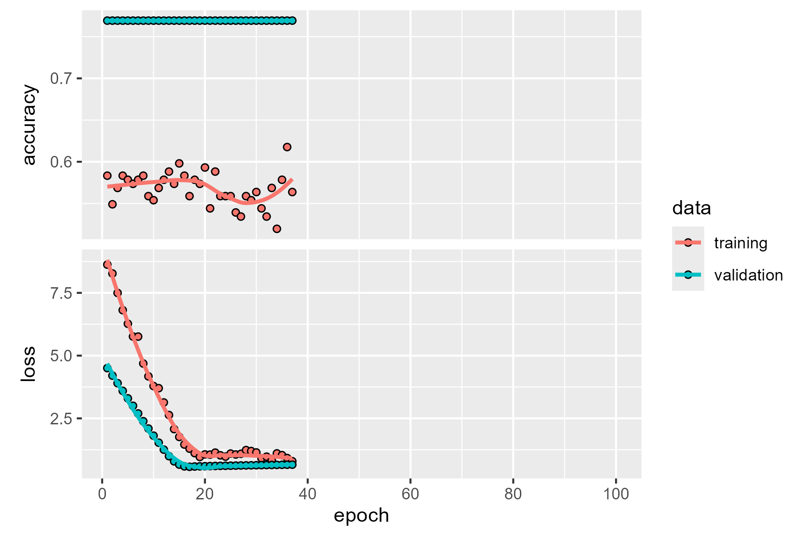
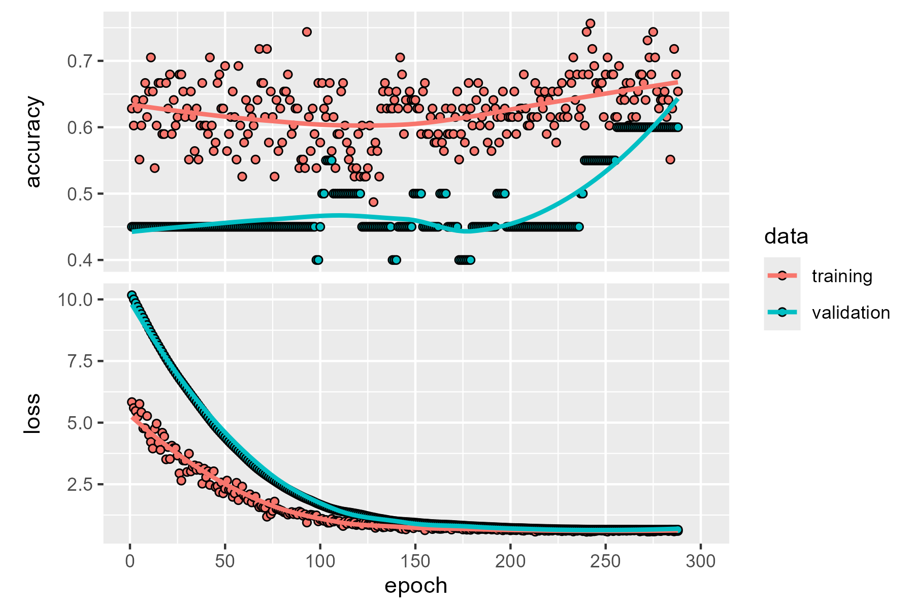

<!-- README.md is generated from README.Rmd. Please edit that file -->

# DeepLearningCausal

<!-- badges: start -->

[](https://CRAN.R-project.org/package=DeepLearningCausal)
[](https://www.gnu.org/licenses/gpl-3.0)


[](https://cran.r-project.org/package=DeepLearningCausal)
<!-- badges: end -->

Our **DeepLearningCausal** R package provides functions for deep learning estimation of Conditional Average Treatment Effects (CATEs) 
from meta-learner models and Population Average Treatment Effects on the Treated (PATT) in settings with treatment noncompliance using *reticulate*, *TensorFlow* 
and *Keras3* packages. The meta-learner models analyzed in our package are the T, S, X and R-learner models (Künzel et al., 2019; Nie and Wager, 2021). 
Estimation of the PATT from experimental and observational datasets with treatment noncompliance is based on the PATT-C model developed by Ottoboni and Poulous (2020).  

Functions in the **DeepLearningCausal** package also enable users to implement the conformal prediction framework to compute and illustrate conformal prediction (CP) 
intervals for estimated individual treatment effects (ITEs) from the meta-learner models. Additional functions in the package permit users to estimate the meta-learner CATEs and the PATT in settings with
treatment noncompliance using weighted ensemble learning via the super learner approach (Polley et al., 2024) and R neural networks via the resilient backpropagation. 

### Why DeepLearningCausal?

Researchers are increasingly interested to estimate causal effects, including Conditional Average Treatment Effects (CATEs)and Population Average Treatment Effects on the Treated (PATT), from observational and experimental data using deep learning methods. Estimating the CATE and PATT via deep neural networks require the use of libraries in Python while also simultaneously using R code and modules. A key advantage of our **DeepLearningCausal** package is that it allows users to not just leverage powerful Python libraries within the R programming environment but also seamlessly use Python's robust deep learning ecosystem in their R session for estimating treatment effects. Another key benefit of our package is that it provide users with substantial flexibility to customize their deep neural network architecture which provides them with options (for example) to: 

- Choose numerous optimization algorithms such as Adam, Stochastic Gradient Descent, AdaGrad or RMSprop to update the deep neural network architecture's weights for loss minimization 
  
- Implement hyperparameter tuning to monitor and mitigate overfitting
  
- Prepare and pre-process their data by splitting their data into training and test datasets or define the number of folds to split their data for cross-validation

The DeepLearningCausal package also provides users the choice of estimating CATE and PATT using both weighted ensemble learning that includes the use of standard ML algorithms (e.g.,gradient boosted trees, lasso, random forests) and training of deep neural networks via the Resilient back propagation (Rprop) algorithm (Riedmiller and Braun, 1993).

### Functions in DeepLearnerCausal Package

| Function                | Description                                                                                             |
|-------------------------|---------------------------------------------------------------------------------------------------------|
|`metalearner_deeplearning ()`| Deep neural network estimation of CATEs for S-, T-, X-, R-learner using reticulate, tensorflow and keras3.|
|`pattc_deeplearning ()` | Deep neural network estimation of PATT using reticulate, tensorflow and keras3.|
|`metalearner_ensemble ()`  |Weighted ensemble learning estimation of CATEs for S-, T-, X-, R-learner using super learner.|
|`metalearner_neural ()`| Deep neural network estimation of CATEs for S-, T-, X-, R-learner using reticulate, tensorflow and keras3. |
|`pattc_ensemble ()`        | Weighted ensemble learning estimation of PATT using super learner.|
|`pattc_neural ()`      | Deep neural network estimation of PATT using neural net.|
|`conformal_plot ()`| Assess meta-learner ITEs with conformal prediction to create statistically valid and reliable conformal prediction intervals.|
|`hte_plot ()`      | Heterogeneous Treatment Effects plots from PATT-C and meta-learner models.|


### Example 1

We employ data from a pilot survey response questionnaire to obtain the CATEs from the S, T, X, and R-learner models that are each estimated using weighted ensemble learning and deep neural networks. This survey response sample incorporates a vignette survey experiment fielded in India. The vignette describes a crisis scenario between country A and B where the leader of country B proposes the necessity of fighting a war with country A. After reading this vignette, respondents are then randomly assigned to the control group or to a binary treatment "strong leader" indicator variable. The treatment variable captures a hawkish policy prescription to the said international crisis by a strong populist leader as opposed to a centrist, non-populist leader. 

After being randomly assigned to the control group or the treatment, the respondents are asked whether or not they are willing to support the policy decision to fight a war against country A. This generates the binary "support war" dependent variable coded as 1 for respondents who support the policy decision of fighting a war against country A; it is coded as 0 otherwise. We also recorded the vignette screen time latency and conducted factual manipulation checks to assess the engagement of respondents--or, in other words, compliance--with the treatment. This permits operationalization of the binary "compliance" coded as 1 for respondents who understood and followed the instructions associated with the strong leader treatment and thus fully complied with this treatment; it is coded as 0 for “noncompliers”. The survey response dataset also includes numerous other covariates summarized in the following table.

| **Covariate**     | **Question**                                                                              |   **Response Scale**                |                        
| ------------------| ----------------------------------------------------------------------------------------- |-------------------------------------|
| **Female**        | gender                                                                                         | Binary (1=Male; Female=2)           |
| **Age**           | what is your age?                                                                              | Numeric                  |
| **Income**        | What is the total monthly income of your household, including the income of all working adults?|Ordinal (1 to 10 where 1=No income to 10=> Rs.4000000/-)|                     
| **Practicing Religion**       | How important is religion in your life?                                                   |Ordinal (1 to 4, where 1=Very important to 4=Not at all important)|
| **Religion**      | Do you belong to a religion or religious denomination? If yes, which one?                 |Categorical (1 to 5, where 1=Christian; 2=Muslim; 3=Hindu; 4=Buddhist; 5=Sikh; 6=others)|
| **Education**     | Could you tell us which of the following education level best matches your education?     | Ordinal (1-5, where 1=None to 5=Post-Graduate) |
| **Political Ideology** | The number 1 means sympathize very strongly with the left and 10 means sympathize very strongly with the right. Where would you place yourself on this scale?  |Ordinal (1 to 10, where 1=[extreme] left to 10=[extreme] right) |
| **Employment**     | what is your current employment status?                                                 | Categorical (1 to 7, where 1= Full time employee to 7=Student; 8=other) |
| **Marital Status**  | What is your marital status?                                                            | Categorical (1 to 7, where 1= Single to 7=Civil Union)         |
| **Job Loss**       | Choose between more job security with a small pay increase and less job security with a big pay increase, which would you pick? |Ordinal (1 to 5, 1= job security & small pay increase to 5= less job security & big pay increase )|
| **Strong Leader** | Treatment Assignment: Strong leader who is not constrained by parliament and perates without parliamentary approval. Reference=Leader constrained by parliament and seeks parliamentary approval.|Binary (1=Strong Leader; 0=Constrained Leader)     |
|**Compliance**| Indicator variable for compliance with binary Treatment assignment| Binary (1=Compliance; 0=Noncompliance)|
| **Support War**       | Dependent variable: What do you think? Would you support your country going to war with country A?           | Binary (1=Yes; 2=No) |

### Example 2
We employ two datasets to obtain the PATT from the PATT-C model that is also estimated via ensemble learning and general deep neural networks.  The first is the survey response dataset for example 1 that was described above. The second is the World Value Survey (WVS) Data for India for the following years in which the WVS implemented their survey questionnaire in the country: 1995, 2001, 2006, 2012, and 2022. The WVS data in this case serves as a representative population-level survey response dataset that includes responses to several questions by respondents that measures their demographic information, dispositional features, and attitudinal characteristics. Importantly, the WVS India data includes questions that permits us to operationalize whether respondents (i)  "support war" that serves as the outcome measure (dependent variable), and (ii) agree with policy prescriptions offered by a hypothetical strong (populist) leader to address foreign policy crises which, in turn, serves as a proxy for the treatment variable in the representative population-level survey data. 

The WVS data for India also includes information such as nonresponses  to the question about attitudes toward the strong leader's policy prescription which served as a proxy to measure compliance in this dataset. Furthermore, the WVS India data employed to estimate the PATT-C model includes responses to questions that directly match the operationalized covariates from our India survey response data summarized above. These questions in the WVS data and the responses to these questions that permit us to operationalize the covariates in this data are summarized in the following table.

| **Covariate**     | **Question**                                                                              |   **Response Scale**                |                        
| ------------------| ----------------------------------------------------------------------------------------- |-------------------------------------|
| **Female**        | Respondent's sex                                                                                        | Binary (1=Male; Female=2)           |
| **Age**           | Can you tell me your year of birth, please? This means you are___years old.                                                                   | Numeric                  |
| **Income**        | On a 10-point scale where 1 indicates “lowest income group” and 10 indicates “highest income group” please tell me in what group your household falls in?|Ordinal (1 to 10, where 1=Lowest Income Group to 10=Highest Income Group)|                     
| **Practicing Religion**       |  Would you say  (religion) is very important, rather important, not very important, not at all important. |Ordinal (1 to 4, where 1=Very important to 4=Not at all important)|
| **Religion**      | Do you belong to a religion or religious denomination? If yes, which one?                 |Categorical (1 to 5, where 1=Christian; 2=Muslim; 3=Hindu; 4=Buddhist; 5=Sikh; 6=others)|
| **Education**     | What is the highest educational level that you have attained?     | Ordinal (1-5, where 1=None to 5=Post-Graduate) |
| **Political Ideology**      | Please tell me where would you place your views on a 10 point scale where 1 is the ‘left’ and 10 is the ‘right’? |Ordinal (1 to 10, where 1=[extreme] left to 10=[extreme] right) |
| **Employment**     |    Are you employed now or not? If yes, then how many hours a week?                                      | Categorical (1 to 7, where 1= Yes, Full time employee to 7=No, unemployed; 8=other) |
| **Marital Status**  | Are you married?                                                           | Categorical (1 to 6, where 1= Married to 6=Single)         |
| **Job Loss**       | To what degree are you worried about losing my job or not finding a job  |Ordinal (1 to 4, 1= very much to 4= not at all)|
|**Strong Leader**|"I'm going to describe various types of political systems and ask what you think of them as a way of governing India? Having a strong leader who does not have to bother with parliament and  elections." Response Coded as "1=Agree" and "0=Not Agree"    | Binary (1=Agree; 0= Not Agree)|
|**Compliance**| Indicator variable for Nonresponse (proxy for compliance) with binary **Strong Leader** Response| Binary (1=Compliance; 0=Noncompliance)|
| **Support War**       |  "We all hope that there will not be another war, but if it were to come to that, would you be willing to fight for your country?" Response Coded as "1=Yes" and "0=No" | Binary (1=Yes; 0=No) |


### Installation

The package is available on CRAN:

``` r
install.packages("DeepLearningCausal")
```

To install the development version from GitHub:

``` r
if (!require("remotes")) install.packages("remotes")
remotes::install_github("hknd23/DeepLearningCausal")
```

Or with devtools: 

``` r
devtools::install_github("hknd23/DeepLearningCausal")
```

### Using the Package: Deep Neural Network Estimation

We illustrate the functionality of **DeepLearningCausal** using the two datasets summarized above. These datasets are included and briefly described in the manual for the package. 

To estimate CATEs from Meta Learners and PATT-C using reticulate, TensorFlow, and Keras. Users must first initialize the Python environment and install required Python modules. To streamline the process, the package provides the function `python_ready()`:

``` r
python_ready()
```

#### Deep Neural Networks for Meta-Learners Using reticulate, tensorflow and keras3

The function `metalearner_deeplearning ()` in our package is employed for deep neural network estimation of the CATEs from the four meta-learner models using reticulate, tensorflow and keras3. The code, customization of the deep neural network architecture, and results from the S-learner model using the said function is presented in the paper. The code and arguments for the X-learner model by using the `metalearner_deeplearning ()` function is presented below while the results from the X-learner model in this case is reported in the paper.


``` r
set.seed(1234)
exp_split <- rsample::initial_split(exp_data,)
train_data <- rsample::training(exp_split)
test_data <- rsample::testing(exp_split)

response_formula <- support_war ~ age + female + education + income + employed +
  job_loss + hindu + political_ideology

Xlearner_deep <- metalearner_deeplearning(cov.formula = response_formula, 
                                          train.data = train_data,
                                          test.data = test_data,
                                          treat.var = "strong_leader", meta.learner.type = "X.Learner",
                                          algorithm = "adam", hidden.layer = c(4,2), hidden_activation = "relu",
                                          output_activation = "sigmoid", output_units = 1,
                                          loss = "binary_crossentropy", metrics = "accuracy", epoch = 50,
                                          batch_size = 32, validation_split = 0.2, dropout_rate = 0.1, patience = 20, 
                                          verbose = 1, seed = 1234)
```
The code and arguments for `metalearner_deeplearning ()` using reticulate, tensorflow and keras3 in the case of the T-learner model is:

<<Nguyen, put 'meta-learner_deeplearning ()' code and arguments for T-learner here>>

The tutorial for `metalearner_deeplearning ()` using using reticulate, tensorflow and keras3 in the case of the R-learner model is:

<<Nguyen, put 'meta-learner_deeplearning ()' code and arguments for T-learner here>>

#### Deep Neural Networks for Meta-Learners Using R Neural Net
The function `metalearner_neural ()` in the package estimates the CATEs from the four meta-learner models using deep neural networks: T-learner, S-learner, X-learner and R-learner. The example below shows via a tutorial the applicability of this function for a small number of observations (*N*) from our survey response (specifically, survey experiment) dataset in Example 1.

``` r
slearner_nn <- metalearner_neural(cov.formula = response_formula,
               data = exp_data, treat.var = "strong_leader",
               meta.learner.type = "S.Learner", stepmax = 1e+9, 
               hidden.layer = c(2, 2), linear.output = FALSE)
```
The tutorial for `metalearner_neural ()` for the S-learner using R neuralnet is [here](/tutorial.md#deep-neural-s-learner). The tutorial for `metalearner_neural ()` for the T-learner using R neuralnet is [here](/tutorial.md#deep-neural-t-learner). The tutorial for `metalearner_neural ()` for the X-learner using R neuralnet is [here](/tutorial.md#deep-neural-x-learner). The tutorial for `metalearner_neural ()` for the R-learner using R neuralnet is [here](/tutorial.md#deep-neural-r-learner).


#### Deep Neural Networks for PATT (settings with treatment noncompliance) Using reticulate, tensorflow and keras3

The function `pattc_deeplearning ()` in our package is employed for deep neural network estimation of the PATT in settings with treatment noncompliance using reticulate, tensorflow and keras3. The code, customization of the deep neural network architecture, and results from obtaining the PATT via using the said function is presented in the paper.

``` r
deeppattc <- pattc_deeplearning(response.formula = response_formula,
                                exp.data = exp_data_full, pop.data = pop_data_full,
                                treat.var = "strong_leader", compl.var = "compliance",
                                compl.algorithm = "adam", response.algorithm = "adam",
                                compl.hidden.layer = c(4,2), response.hidden.layer = c(4,2),
                                compl.hidden_activation = "relu", response.hidden_activation = "relu",
                                response.output_activation = "sigmoid", response.output_units = 1, 
                                response.loss = "binary_crossentropy", response.metrics = "accuracy",
                                compl.epoch = 100, response.epoch = 300, verbose = 1, batch_size = 32, 
                                compl.validation_split = 0.2, response.validation_split = 0.2, 
                                compl.dropout_rate = 0.1, response.dropout_rate = 0.1,
                                compl.patience = 20, response.patience = 20,
                                nboot = 1000, 
                                seed = 1234)
```

```r
plot(deep_pattc$complier_history)
plot(deep_pattc$response_history)
```

Users can employ "plot(deeppattc\$complier\_history)" and "plot(deeppattc\$response\_history)" to illustrate the trace plots of the loss and metric functions of the complier and response models used for estimating the PATT. 

<!-- -->
<!-- -->

The trace plots for the complier and response model enables users to assess whether their deep neural network architecture is learning and identifying overfitting when estimating PATT in data with treatment noncompliance. Overall, these figures reveal stable learning given the steady decreases in loss but increase in accuracy for both the complier and response model.  


#### Deep Neural Networks for PATT (settings with treatment noncompliance) Using R Neuralnet 
The function `PATTC_neural` implements deep neural network estimation of the PATT from the PATT-C model for experimental data (in settings with noncompliance) using the R neuralnet package. The tutorial in the example below shows the applicability of this function for a small number of observations using both the survey response dataset in Example 1 and the WVS response dataset in Example 2. 

```r
pattc_nn <- pattc_neural(response.formula = response_formula,
            exp.data = exp_data, pop.data = pop_data,
            treat.var = "strong_leader", compl.var = "compliance",
            compl.hidden.layer = c(2, 2),
            response.hidden.layer = c(2, 2),
            compl.stepmax = 1e+09, response.stepmax = 1e+09)
```

The distribution of the deep neural network-estimated PATT obtained from the PATT-C model using R neuralnet can be visualized by using `plot(pattc_nn)`.


The tutorial for `pattc_neural` for the PATT-C model using R neuralnet is available [here](/tutorial.md#deep-neural-patt-c). 


### Using the Package: Weighted Ensemble Learning Via SuperLearner


#### Weighted Ensemble Learning for Meta-Learners

The function `metalearner_ensemble` in our package enables weighted ensemble learning estimation of CATEs from the following four meta-learner models via the Super Learner approach: the S-learner, T-learner X-learner, and R-learner. To allow for easy replication, the example below shows via a tutorial the applicability of this function for a small number of observations (N) from our survey response dataset in Example 1 that incorporates a survey experiment.

``` r
library(DeepLearningCausal)
data("exp_data")
library(SuperLearner)

response_formula <- support_war ~ age + female + education + income +
                    employed + job_loss + hindu + political_ideology
SLlearners = c("SL.xgboost", "SL.ranger", "SL.nnet","SL.glm")
set.seed(123456)

slearner_en <- metalearner_ensemble(cov.formula = response_formula,
               data = exp_data,
               treat.var = "strong_leader",
               meta.learner.type = "S.Learner",
               SL.learners = SLlearners)
```

The tutorial for `metalearner_ensemble` for the S-learner is [here](/tutorial.md#ensemble-s-learner). The tutorial for `metalearner_ensemble` for the T-learner is [here](/tutorial.md#ensemble-t-learner). The tutorial for `metalearner_ensemble` for the X-learner is [here](/tutorial.md#ensemble-x-learner). The tutorial for `metalearner_ensemble` for the R-learner is [here](/tutorial.md#ensemble-r-learner)


#### Weighted Ensemble Learning for Estimating PATT in datasets with Treatment Noncompliance
The function `PATTC_ensemble` estimates the PATT-C model via weighted ensemble learning using the SuperLearner package. This enables users to estimate PATT from experimental and observational data with treatment noncompliance. The example below shows via a tutorial the applicability of this function for a small number of observations (N) using both the survey experiment dataset in Example 1 and the observational Word Values Survey (WVS) response dataset in Example 2.

```r
pattc_en <- pattc_ensemble(response.formula = response_formula,
            exp.data = exp_data, pop.data = pop_data,
            treat.var = "strong_leader", compl.var = "compliance",
            compl.SL.learners = SLlearners,
            response.SL.learners = SLlearners)
```

Our package includes features and functions that enables users to extract and illustrate two types of figures from the PATT that is obtained from the PATT-C model via weighted ensemble learning using the Super Learner approach. The first is the distribution of the estimated PATT of the treatment indicator on the dependent variable using plot(pattc_en).

The second is heterogeneous treatment effects that users can employ to assess and visualize whether the PATT varies significantly across different subgroups in our example datasets. The plot for the heterogeneous treatment effects obtained in this case can be obtained by using the `hte_plot` function, as shown in the accompanying paper by Huynh et al. (2025). Finally, the tutorial for the `PATTC_ensemble` for the PATT-C model in this case is [here](/tutorial.md#ensemble-patt-c).


### References
Khoi, N., Y. Yang, and B. Mukherjee. 2025. "DeepLearningCausal: R Package for Estimating Treatment Effects Using Deep Neural Networks and Ensemble Learning." Working Paper, Hitotsubashi University and Penn State University. 

Künzel, S. R., J.S. Sekhon, P.J. Bickel, and B. Yu. 2019. “Metalearners for estimating heterogeneous treatment effects using machine  learning.” Proceedings of the National Academy of Science, 116, 4156–4165. DOI: https://doi.org/10.1073/pnas.1804597116 

Nie, X., and S. Wager. 2021. "Quasi-oracle estimation of heterogeneous treatment effects." Biometrika, 108(2):299–319. DOI: https://academic.oup.com/biomet/article-abstract/108/2/299/5911092 

Ottoboni K.N. and J.V. Populos. 2020. “Estimating population average treatment effects from experiments with noncompliance” Journal of Causal Inference 8:108-130. DOI: https://www.degruyter.com/document/doi/10.1515/jci-2018-0035/html 

Polley P., LeDell E., Kennedy C., Lendle S., Laan VDM. 2024. SuperLearner: Super Learner Prediction. DOI: https://cran.r-project.org/web/packages/SuperLearner/index.html

Riedmiller, M. and Braun, H.A. 1993. "Direct Adaptive Method for Faster Back-Propagation Learning: The RPROP Algorithm." Proceedings of the IEEE International Conference on Neural Networks, 28 March-1 April 1993, San Francisco, CA, 586-591. DOI: https://doi.org/10.1109/ICNN.1993.298623

