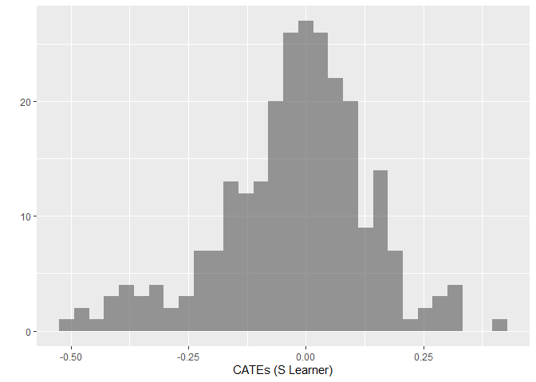
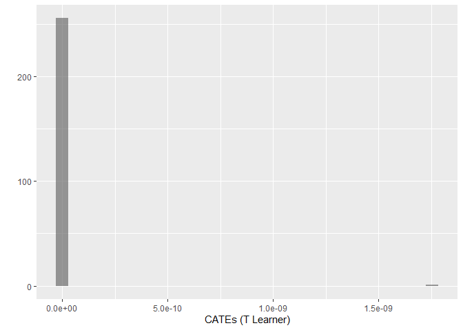
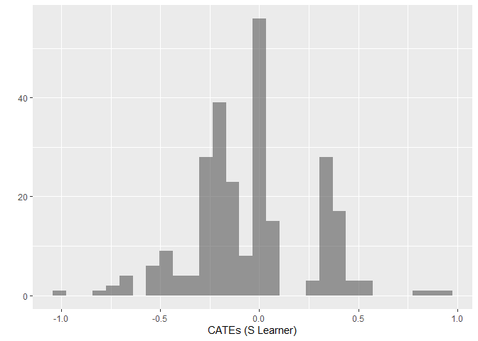
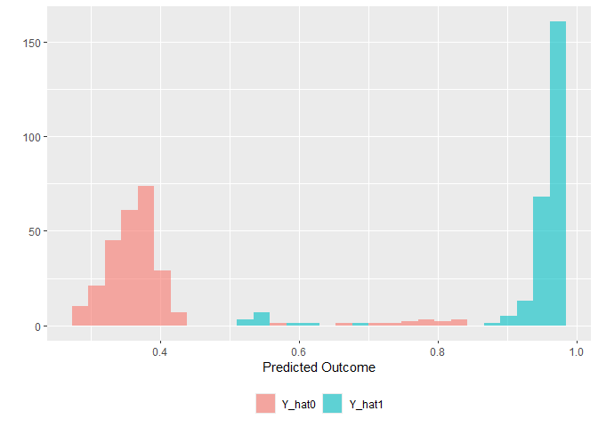
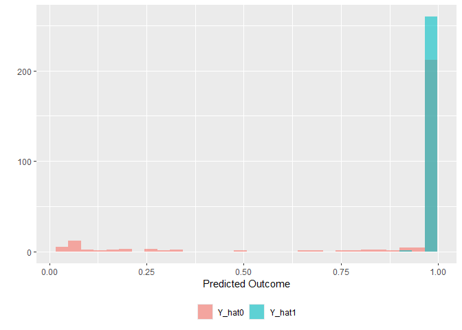

<!-- README.md is generated from README.Rmd. Please edit that file -->

# DeepLearningCausal

<!-- badges: start -->

[](https://CRAN.R-project.org/package=DeepLearningCausal)
[](https://www.gnu.org/licenses/gpl-3.0)

[](https://cran.r-project.org/package=DeepLearningCausal)
<!-- badges: end -->

**DeepLearningCausal** is an R package that provides functions to estimate the Conditional Average Treatment Effects (CATE)
and Population Average Treatment Effects on the Treated (PATT) from experimental and observational data using both
ensemble learning and deep learning (specifically, deep neural networks) methods. The package first provides functions to implement two meta-learner models,
the Single-learner (S-learner) and Two-learner (T-learner) model, for estimating the CATE using ensemble and deep learning methods. These meta-learners are described in Künzel et al. (2019). It then provides functions to implement the Ottoboni and Poulos (2020) PATT-C estimator to obtain the Population Average Treatment Effects on the Treated (PATT) from experimental and observational data with noncompliance by also ensemble and deep learning methods.

### Why DeepLearningCausal?

Researchers are increasingly interested to estimate causal effecs, including Conditional Average Treatment Effects (CATE)
and Population Average Treatment Effects (PATE), from observational and experimental data using machine learning (ML) and deep learning. A unique advantage of the DeepLearningCausal package is that it provides a single user-friendly pacakge that users can employ to estimate the CATE from
experimental and observational data as well as Population Average Treatment Effects on the Treated (PATT) from experimental and observational
data with noncompliance. Another key benefit of DeepLearningCausal is that it provides users the choice of estimating CATE and PATT using both ensemble learning and deep neural networks. More specifically,

- Ensemble learning includes the candidate algorithms: gradient boosted trees, lasso, random forests, and neural nets. It combines these algorithms with a convex combination of weights based on minimizing cross-validated error.These algorithms are drawn from the 42 different ML methods in SuperLearner package developed by Polley et al. (2024). 
  
- Deep Neural Networks training via Resilient back propagation (Rprop) algorithm.

### Functions in DeepLearnerCausal Package

| Function                | Description                                                                                |
|-------------------------|--------------------------------------------------------------------------------------------|
| `metalearner_ensemble`  | Estimates CATE for S-learner and T-learner using super learner weighted ensemble.          |
| `metalearner_deepneural`| Estimates CATE for S-learner and T-learner using deep neural networks.                     |
| `PATTC_ensemble`        | Estimates PATT_C estimator for obtaining PATT using super learner weighted ensemble.       |
| `PATTC_deepneural`      | Estimates PATT_C estimator for obtaining PATT using deep neural networks.                  |


### Example 1

We employ data from a pilot survey response questionnaire (administered online) to obtain the CATE from the S-learner and T-learner models that are each estimated using ensemble learning and deep neural networks. This survey response sample incorporates a vignette survey experiment fielded in India. The vignette describes a crisis scenario between country A and B where the leader of country B proposes the necessity of fighting a war with country A. After reading this vignette,
respondents are then randomly assigned to the control group or to a binary treatment "strong leader" indicator variable. The treatment variable captures a hawkish policy prescription to the said international crisis by a strong populist leader as opposed to a centrist, non-populist leader. 

After being randomly assigned to the control group or the treatment, the respondents are asked whether or not they are willing to support the policy decision to fight a war against country A. This generates the binary "support war" dependent variable coded as 1 for respondents who support the policy decision of fighting a war against country A; it is coded as 0 otherwise. We also recorded the vignette screen time latency and conducted factual manipulation checks to assess the engagement of respondents--or, in other words, compliance--with the treatment. This permits operationalization of the binary "compliance" coded as 1 for respondents who understood and followed the instructions associated with the strong leader treatment and thus fully complied with this treatment; it is coded as 0 for “noncompliers”. The survey response dataset also includes numerous other covariates summarized in the following table.

| **Covariate**     | **Question**                                                                              |   **Response Scale**                |                        
| ------------------| ----------------------------------------------------------------------------------------- |-------------------------------------|
| **Female**        | gender                                                                                         | Binary (1=Male; Female=2)           |
| **Age**           | what is your age?                                                                              | Numeric                  |
| **Income**        | What is the total monthly income of your household, including the income of all working adults?|Ordinal (1 to 10 where 1=No income to 10=> Rs.4000000/-)|                     
| **Practicing Religion**       | How important is religion in your life?                                                   |Ordinal (1 to 4, where 1=Very important to 4=Not at all important)|
| **Religion**      | Do you belong to a religion or religious denomination? If yes, which one?                 |Categorical (1 to 5, where 1=Christian; 2=Muslim; 3=Hindu; 4=Buddhist; 5=Sikh; 6=others)|
| **Education**     | Could you tell us which of the following education level best matches your education?     | Ordinal (1-5, where 1=None to 5=Post-Graduate) |
| **Political Ideology** | The number 1 means sympathize very strongly with the left and 10 means sympathize very strongly with the right. Where would you place yourself on this scale?  |Ordinal (1 to 10, where 1=[extreme] left to 10=[extreme] right) |
| **Employment**     | what is your current employment status?                                                 | Categorical (1 to 7, where 1= Full time employee to 7=Student; 8=other) |
| **Marital Status**  | What is your marital status?                                                            | Categorical (1 to 7, where 1= Single to 7=Civil Union)         |
| **Job Loss**       | Choose between more job security with a small pay increase and less job security with a big pay increase, which would you pick? |Ordinal (1 to 5, 1= job security & small pay increase to 5= less job security & big pay increase )|
| **Strong Leader** | Treatment Assignment: Strong leader who is not constrained by parliament and perates without parliamentary approval. Reference=Leader constrained by parliament and seeks parliamentary approval.|Binary (1=Strong Leader; 0=Constrained Leader)     |
|**Compliance**| Indicator variable for compliance with binary Treatment assignment| Binary (1=Compliance; 0=Noncompliance)|
| **Support War**       | Dependent variable: What do you think? Would you support your country going to war with country A?           | Binary (1=Yes; 2=No) |

### Example 2
We employ two datasets to obtain the PATT from the PATT-C model that is also estimated via ensemble learning and deep neural networks.  The first is the survey response dataset for example 1 that was described above. The second is the World Value Survey (WVS) Data for India for the following years in which the WVS implemented their survey questionnaire in the country: 1995, 2001, 2006, 2012, and 2022. The WVS data in this case serves as a representative population-level survey response dataset that includes responses to several questions by respondents that measures their demographic information, dispositional features, and attitudinal characteristics. Importantly, the WVS India data includes questions that permits us to operationalize whether respondents (i)  "support war" that serves as the outcome measure (dependent variable), and (ii) agree with policy prescriptions offered by a hypothetical strong (populist) leader to address foreign policy crises which, in turn, serves as a proxy for the treatment variable in the representative population-level survey data. 

The WVS data for India also includes information such as nonresponses  to the question about attitudes toward the strong leader's policy prescription which served as a proxy to measure compliance in this dataset. Furthermore, the WVS India data employed to estimate the PATT-C model includes responses to questions that directly match the operationalized covariates from our India survey response data summarized above. These questions in the WVS data and the responses to these questions that permit us to operationalize the covariates in this data are summarized in the following table.

| **Covariate**     | **Question**                                                                              |   **Response Scale**                |                        
| ------------------| ----------------------------------------------------------------------------------------- |-------------------------------------|
| **Female**        | Respondent's sex                                                                                        | Binary (1=Male; Female=2)           |
| **Age**           | Can you tell me your year of birth, please? This means you are___years old.                                                                   | Numeric                  |
| **Income**        | On a 10-point scale where 1 indicates “lowest income group” and 10 indicates “highest income group” please tell me in what group your household falls in?|Ordinal (1 to 10, where 1=Lowest Income Group to 10=Highest Income Group)|                     
| **Practicing Religion**       |  Would you say  (religion) is very important, rather important, not very important, not at all important. |Ordinal (1 to 4, where 1=Very important to 4=Not at all important)|
| **Religion**      | Do you belong to a religion or religious denomination? If yes, which one?                 |Categorical (1 to 5, where 1=Christian; 2=Muslim; 3=Hindu; 4=Buddhist; 5=Sikh; 6=others)|
| **Education**     | What is the highest educational level that you have attained?     | Ordinal (1-5, where 1=None to 5=Post-Graduate) |
| **Political Ideology**      | Please tell me where would you place your views on a 10 point scale where 1 is the ‘left’ and 10 is the ‘right’? |Ordinal (1 to 10, where 1=[extreme] left to 10=[extreme] right) |
| **Employment**     |    Are you employed now or not? If yes, then how many hours a week?                                      | Categorical (1 to 7, where 1= Yes, Full time employee to 7=No, unemployed; 8=other) |
| **Marital Status**  | Are you married?                                                           | Categorical (1 to 6, where 1= Married to 6=Single)         |
| **Job Loss**       | To what degree are you worried about losing my job or not finding a job  |Ordinal (1 to 4, 1= very much to 4= not at all)|
|**Strong Leader**|"I'm going to describe various types of political systems and ask what you think of them as a way of governing India? Having a strong leader who does not have to bother with parliament and  elections." Response Coded as "1=Agree" and "0=Not Agree"    | Binary (1=Agree; 0= Not Agree)|
|**Compliance**| Indicator variable for Nonresponse (proxy for compliance) with binary **Strong Leader** Response| Binary (1=Compliance; 0=Noncompliance)|
| **Support War**       |  "We all hope that there will not be another war, but if it were to come to that, would you be willing to fight for your country?" Response Coded as "1=Yes" and "0=No" | Binary (1=Yes; 0=No) |


### Dependencies

- ROCR
- caret
- neuralnet
- SuperLearner
- class
- xgboost
- randomForest
- glmnet
- gam
- e1071
- gbm
- Hmisc
- weights


### Installation

The latest version of the package (`0.0.104`) is available on

``` r
install.packages("DeepLearningCausal")
```

To install the development version from GitHub:

``` r
if (!require("remotes")) install.packages("remotes")
remotes::install_github("hknd23/DeepLearningCausal")
```

Or with devtools: 

``` r
devtools::install_github("hknd23/DeepLearningCausal")
```

#### Using the Package

We illustrate the functionality of **DeepLearningCausal** using the two survey response datasets summarized above. The data from these two survey response datasets is included and briefly described in the manual for the package. 

#### Ensemble Learning for Meta-Leaners

The function `metalearner_ensemble` in the package estimates the CATE from the two meta-learner models, the S-learner and T-learner, using ensemble learning. To allow for easy replication, the example below shows via a tutorial the applicability of this function for a small number of observations (N) from our survey response dataset in Example 1 that incorporates a survey experiment.

The tutorial for `metalearner_ensemble` for the S-learner is [here](/tutorial.md#ensemble-s-learner).

<!-- -->
<!-- -->

The tutorial for `metalearner_ensemble` for the T-learner is [here](/tutorial.md#ensemble-t-learner).

The estimated CATE for the T-learner and S-learner obtained via ensemble learning can be displayed by using XX: 

<!-- -->
<!-- -->


#### Ensemble Learning for PATT-C Estimator
The function `PATTC_ensemble` estimates the PATT-C model (i.e. estimating PATT for experimental data in which some units do not comply with the treatment) using ensemble learning. The example below shows via a tutorial the applicability of this function for a small number of observations (N) using both the survey response dataset in Example 1 and the Word Values Survey (WVS) response dataset in Example 2.

The tutorial for the `PATTC_ensemble` for the PATT-C model is [here](/tutorial.md#ensemble-patt-c).

The estimated PATT from the PATT_C model using ensemble learning can be illustrated by using XX: 
<!-- --> 


#### Deep Neural networks for Meta-Learners
The function `metalearner_deepneural` in the package estimates the CATE from the two meta-learner models, the S-learner and T-learner, using deep neural networks. The example below shows via a tutorial the applicability of this function for a small number of observations (N) from our survey response (specifically, survey experiment) dataset in Example 1.


The tutorial for `metalearner_deepneural` for the S-learner is [here](/tutorial.md#deep-neural-s-learner).

The tutorial for `metalearner_deepneural` for the T-learner is [here](/tutorial.md#deep-neural-t-learner).

#### Deep Neural Networks for PATT-C Estimator
The function `PATTC_deepneural` estimates the PATT from the PATT-C model for experimental data (in settings with noncompliance) using deep neural networks. The tutorial in the example below shows thw applicability of this function for a small number of observations using both the survey response dataset in Example 1 and the WVS response dataset in Example 2. 

The tutorial for `PATTC_deepneural` is [here](/tutorial.md#deep-neural-patt-c).

The estimated PATT from the PATT_C model using deep neural networks can be illustrated by using XX:

<!-- --> 

### References
Künzel, S. R., J.S. Sekhon, P.J. Bickel, and B. Yu, B. 2019. “Metalearners for estimating heterogeneous treatment effects using machine  learning.” Proceedings of the National Academy of Science, 116, 4156–4165. DOI: https://doi.org/10.1073/pnas.1804597116 

Ottoboni K.N. and J.V. Populos. 2020. “Estimating population average treatment effects from experiments with noncompliance” Journal of Causal Inference 8:108-130. DOI: https://www.degruyter.com/document/doi/10.1515/jci-2018-0035/html 

Polley P., LeDell E., Kennedy C., Lendle S., Laan VDM. 2024. SuperLearner: Super Learner Prediction. DOI:\\https://cran.r-project.org/web/packages/SuperLearner/index.html

