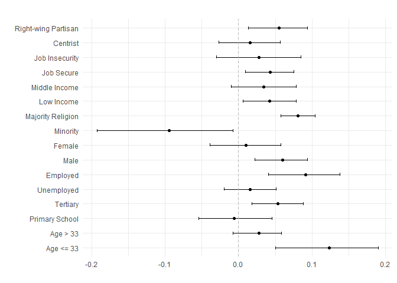

<!-- README.md is generated from README.Rmd. Please edit that file -->

# DeepLearningCausal

<!-- badges: start -->

[](https://CRAN.R-project.org/package=DeepLearningCausal)
[](https://www.gnu.org/licenses/gpl-3.0)


[](https://cran.r-project.org/package=DeepLearningCausal)
<!-- badges: end -->

Our **DeepLearningCausal** R package provides functions that enables users to employ deep neural networks to estimate Conditional Average Treatment Effects (CATEs) from four meta-learner models and the Population Average Treatment Effects on the Treated (PATT) in settings with treatment noncompliance. The four meta-learner models analyzed in our package are the T-learner, S-learner, X-learner and R-learner models (Künzel et al., 2019; Nie and Wager, 2021). Estimation of the PATT from experimental and observational data with treatment noncompliance is based on the PATT-C model developed by Ottoboni and Poulous (2020).  

The functions in the **DeepLearningCausal** package enables users to employ deep neural networks (i.e. deep learning) for estimating CATEs and the PATT using the *reticulate*, *TensorFlow*, and *Keras3* packages, which gives them access to Python’s deep learning libraries in their R session. If users prefer to employ deep learning estimation without enabling Python, our package also provides functions that allows them to implement deep neural network estimation of CATEs and PATT by using the R neural net package. The package also includes functions that allows users to estimate CATEs from the four meta-learner models and the PATT by using weighted ensemble learning via the SuperLearner package developed by Polley et al. (2024). 

Furthermore, the DeepLearningCausal package includes functions to extract and illustrate heterogeneous treatment effects from the estimated meta-learner models and the PATT from settings with treatment noncompliance. The package includes features that enables users to visualize and assess conformal inference for treatment effects obtain from the meta-learner models---this entails combining the meta-learner models, which estimates individual treatment effects (ITEs), with conformal prediction to create statistically valid and reliable prediction intervals. Finally, the package allows users to extract trace plots and accuracy plots to assess the performance of their deep neural network architecture employed for estimation, plot the distribution and pairwise correlations of estimated individual treatment effects from the meta-learner models, and display the distribution of the PATT estimate obtained from data with treatment compliance. 


### Why DeepLearningCausal?

Researchers are increasingly interested to estimate causal effecs, including Conditional Average Treatment Effects (CATEs)and Population Average Treatment Effects on the Treated (PATT), from observational and experimental data using deep learning methods. Estimating the CATE and PATT via deep neural networks require the use of libraries in Python while also simultaneously using R code and modules. A key advantage of our **DeepLearningCausal** package is that it allows users to not just leverage powerful Python libraries within the R programming environment but also seamlessly use Python's robust deep learning ecosystem in their R session for estimating treatment effects. Another key benefit of our package is that it provide users with substantial flexibility to customize their deep neural network architecture which provides them with options (for example) to: 

- Choose numerous optimization algorithms such as Adam, Stochastic Gradient Descent, AdaGrad or RMSprop to update the deep neural network architecture's weights for loss minimization 
  
- Implement hyperparameter tuning to monitor and mitigate overfitting
  
- Prepare and pre-process their data by splitting their data into training and test datasets or define the number of folds to split their data for cross-validation

The DeepLearningCausal package also provides users the choice of estimating CATE and PATT using both weighted ensemble learning that includes the use of standard ML algorithms (e.g.,gradient boosted trees, lasso, random forests) and training of deep neural networks via the Resilient back propagation (Rprop) algorithm (Riedmiller and Braun, 1993).

### Functions in DeepLearnerCausal Package

| Function                | Description                                                                                             |
|-------------------------|---------------------------------------------------------------------------------------------------------|
|`metalearner_deepneural`| Deep neural network estimation of CATEs for S-, T-, X-, R-learner using reticulate, tensorflow and keras3.|
|`pattc_deepneural` | Deep neural network estimation of PATT using reticulate, tensorflow and keras3.|
| `metalearner_ensemble`  |Weighted ensemble learning estimation of CATEs for S-, T-, X-, R-learner using super learner.|
| `metalearner_deepneural`| Deep neural network estimation of CATEs for S-, T-, X-, R-learner using reticulate, tensorflow and keras3. |
| `pattc_ensemble`        | Weighted ensemble learning estimation of PATT using super learner.|
| `pattc_deepneural`      | Deep neural network estimation of PATT using neural net.|
|`conformal_plot`| Assess meta-learner ITEs with conformal prediction to create statistically valid and reliable prediction intervals.|
| `hte_plot`      | Heterogeneous Treatment Effects plots from PATT-C and meta-learner models.|


### Example 1

We employ data from a pilot survey response questionnaire (administered online) to obtain the CATE from the S-learner, T-learner X-learner, and R-learner models that are each estimated using weighted ensemble learning and deep neural networks. This survey response sample incorporates a vignette survey experiment fielded in India. The vignette describes a crisis scenario between country A and B where the leader of country B proposes the necessity of fighting a war with country A. After reading this vignette, respondents are then randomly assigned to the control group or to a binary treatment "strong leader" indicator variable. The treatment variable captures a hawkish policy prescription to the said international crisis by a strong populist leader as opposed to a centrist, non-populist leader. 

After being randomly assigned to the control group or the treatment, the respondents are asked whether or not they are willing to support the policy decision to fight a war against country A. This generates the binary "support war" dependent variable coded as 1 for respondents who support the policy decision of fighting a war against country A; it is coded as 0 otherwise. We also recorded the vignette screen time latency and conducted factual manipulation checks to assess the engagement of respondents--or, in other words, compliance--with the treatment. This permits operationalization of the binary "compliance" coded as 1 for respondents who understood and followed the instructions associated with the strong leader treatment and thus fully complied with this treatment; it is coded as 0 for “noncompliers”. The survey response dataset also includes numerous other covariates summarized in the following table.

| **Covariate**     | **Question**                                                                              |   **Response Scale**                |                        
| ------------------| ----------------------------------------------------------------------------------------- |-------------------------------------|
| **Female**        | gender                                                                                         | Binary (1=Male; Female=2)           |
| **Age**           | what is your age?                                                                              | Numeric                  |
| **Income**        | What is the total monthly income of your household, including the income of all working adults?|Ordinal (1 to 10 where 1=No income to 10=> Rs.4000000/-)|                     
| **Practicing Religion**       | How important is religion in your life?                                                   |Ordinal (1 to 4, where 1=Very important to 4=Not at all important)|
| **Religion**      | Do you belong to a religion or religious denomination? If yes, which one?                 |Categorical (1 to 5, where 1=Christian; 2=Muslim; 3=Hindu; 4=Buddhist; 5=Sikh; 6=others)|
| **Education**     | Could you tell us which of the following education level best matches your education?     | Ordinal (1-5, where 1=None to 5=Post-Graduate) |
| **Political Ideology** | The number 1 means sympathize very strongly with the left and 10 means sympathize very strongly with the right. Where would you place yourself on this scale?  |Ordinal (1 to 10, where 1=[extreme] left to 10=[extreme] right) |
| **Employment**     | what is your current employment status?                                                 | Categorical (1 to 7, where 1= Full time employee to 7=Student; 8=other) |
| **Marital Status**  | What is your marital status?                                                            | Categorical (1 to 7, where 1= Single to 7=Civil Union)         |
| **Job Loss**       | Choose between more job security with a small pay increase and less job security with a big pay increase, which would you pick? |Ordinal (1 to 5, 1= job security & small pay increase to 5= less job security & big pay increase )|
| **Strong Leader** | Treatment Assignment: Strong leader who is not constrained by parliament and perates without parliamentary approval. Reference=Leader constrained by parliament and seeks parliamentary approval.|Binary (1=Strong Leader; 0=Constrained Leader)     |
|**Compliance**| Indicator variable for compliance with binary Treatment assignment| Binary (1=Compliance; 0=Noncompliance)|
| **Support War**       | Dependent variable: What do you think? Would you support your country going to war with country A?           | Binary (1=Yes; 2=No) |

### Example 2
We employ two datasets to obtain the PATT from the PATT-C model that is also estimated via ensemble learning and general deep neural networks.  The first is the survey response dataset for example 1 that was described above. The second is the World Value Survey (WVS) Data for India for the following years in which the WVS implemented their survey questionnaire in the country: 1995, 2001, 2006, 2012, and 2022. The WVS data in this case serves as a representative population-level survey response dataset that includes responses to several questions by respondents that measures their demographic information, dispositional features, and attitudinal characteristics. Importantly, the WVS India data includes questions that permits us to operationalize whether respondents (i)  "support war" that serves as the outcome measure (dependent variable), and (ii) agree with policy prescriptions offered by a hypothetical strong (populist) leader to address foreign policy crises which, in turn, serves as a proxy for the treatment variable in the representative population-level survey data. 

The WVS data for India also includes information such as nonresponses  to the question about attitudes toward the strong leader's policy prescription which served as a proxy to measure compliance in this dataset. Furthermore, the WVS India data employed to estimate the PATT-C model includes responses to questions that directly match the operationalized covariates from our India survey response data summarized above. These questions in the WVS data and the responses to these questions that permit us to operationalize the covariates in this data are summarized in the following table.

| **Covariate**     | **Question**                                                                              |   **Response Scale**                |                        
| ------------------| ----------------------------------------------------------------------------------------- |-------------------------------------|
| **Female**        | Respondent's sex                                                                                        | Binary (1=Male; Female=2)           |
| **Age**           | Can you tell me your year of birth, please? This means you are___years old.                                                                   | Numeric                  |
| **Income**        | On a 10-point scale where 1 indicates “lowest income group” and 10 indicates “highest income group” please tell me in what group your household falls in?|Ordinal (1 to 10, where 1=Lowest Income Group to 10=Highest Income Group)|                     
| **Practicing Religion**       |  Would you say  (religion) is very important, rather important, not very important, not at all important. |Ordinal (1 to 4, where 1=Very important to 4=Not at all important)|
| **Religion**      | Do you belong to a religion or religious denomination? If yes, which one?                 |Categorical (1 to 5, where 1=Christian; 2=Muslim; 3=Hindu; 4=Buddhist; 5=Sikh; 6=others)|
| **Education**     | What is the highest educational level that you have attained?     | Ordinal (1-5, where 1=None to 5=Post-Graduate) |
| **Political Ideology**      | Please tell me where would you place your views on a 10 point scale where 1 is the ‘left’ and 10 is the ‘right’? |Ordinal (1 to 10, where 1=[extreme] left to 10=[extreme] right) |
| **Employment**     |    Are you employed now or not? If yes, then how many hours a week?                                      | Categorical (1 to 7, where 1= Yes, Full time employee to 7=No, unemployed; 8=other) |
| **Marital Status**  | Are you married?                                                           | Categorical (1 to 6, where 1= Married to 6=Single)         |
| **Job Loss**       | To what degree are you worried about losing my job or not finding a job  |Ordinal (1 to 4, 1= very much to 4= not at all)|
|**Strong Leader**|"I'm going to describe various types of political systems and ask what you think of them as a way of governing India? Having a strong leader who does not have to bother with parliament and  elections." Response Coded as "1=Agree" and "0=Not Agree"    | Binary (1=Agree; 0= Not Agree)|
|**Compliance**| Indicator variable for Nonresponse (proxy for compliance) with binary **Strong Leader** Response| Binary (1=Compliance; 0=Noncompliance)|
| **Support War**       |  "We all hope that there will not be another war, but if it were to come to that, would you be willing to fight for your country?" Response Coded as "1=Yes" and "0=No" | Binary (1=Yes; 0=No) |


### Dependencies

- ROCR
- caret
- neuralnet
- SuperLearner
- class
- xgboost
- randomForest
- glmnet
- gam
- e1071
- gbm
- Hmisc
- ggplot2
- dplyr
- tidyr
- magrittr
- weights

### Installation

The latest version of the package (`0.0.104`) is available on

``` r
install.packages("DeepLearningCausal")
```

To install the development version from GitHub:

``` r
if (!require("remotes")) install.packages("remotes")
remotes::install_github("hknd23/DeepLearningCausal")
```

Or with devtools: 

``` r
devtools::install_github("hknd23/DeepLearningCausal")
```

### Using the Package: Meta-Learner Models

We illustrate the functionality of **DeepLearningCausal** using the two datasets summarized above. These datasets are included and briefly described in the manual for the package. 

#### Ensemble Learning for Meta-Learners

The function `metalearner_ensemble` in the package estimates the CATE from the following four meta-learner models using weighted ensemble learning: the S-learner, T-learner X-learner, and R-learner. To allow for easy replication, the example below shows via a tutorial the applicability of this function for a small number of observations (N) from our survey response dataset in Example 1 that incorporates a survey experiment.

``` r
library(DeepLearningCausal)
data("exp_data")
library(SuperLearner)

response_formula <- support_war ~ age + female + education + income +
                    employed + job_loss + hindu + political_ideology
SLlearners = c("SL.xgboost", "SL.ranger", "SL.nnet","SL.glm")
set.seed(123456)

slearner_en <- metalearner_ensemble(cov.formula = response_formula,
               data = exp_data,
               treat.var = "strong_leader",
               meta.learner.type = "S.Learner",
               SL.learners = SLlearners)
```

#### Plotting Treatment Effects From Meta-Learners Ensemble 
The **DeepLearningCausal** package includes numerous features and functions that enable users to extract and illustrate three types of plots from the CATEs obtained from the meta-learner models estimated via weighted ensemble learning. First, users can illustrate both the estimated CATE with confidence intervals and the distribution of the estimated CATE of their treatment indicator on the dependent variable from all the meta-learner models in the package, as demonstrated in our accompanying paper (Huynh et al., 2025). Second, the `hte_plot` function in the package enables users to obtain and illustrate heterogeneous treatment effects (HTE) that can help them identify whether the treatment effect of interest varies across different subgroups in their data. As an example, after estimating the CATE from the S-Learner and the R-learner model via weighted ensemble learning, we employed the `hte_plot` function to assess whether the treatment effect of the *Strong Leader* indicator on *Support War* differs for the subgroup indicators of interest from our survey experiment data. Doing so generates the HTE figures from the S-learner and R-learner estimated via weighted ensemble learning:
```r
cut_points <- c(33, .5, 4, 4, .5, 2, .5, 5)
labels <- c("Age <= 33", "Age > 33", "Primary School", "Tertiary", "Unemployed",         
            "Employed", "Male", "Female",  "Minority", "Majority Religion" ,
            "Low Income",  "Middle Income",  "Job Secure",  "Job Insecurity",
            "Centrist", "Right-wing Partisan")
```
```r
hte_plot(slearner_en, cut_points = cut_points, custom_labels = labels , boot = TRUE,
         n_boot = 1000)
```

<!-- -->
    

```r
hte_plot(rlearner_en, cut_points = cut_points, custom_labels = labels ,  boot = TRUE,
         n_boot = 1000)
```

<!-- -->


#### Tutorials for Meta-Learners Ensemble 

The tutorial for `metalearner_ensemble` for the S-learner is [here](/tutorial.md#ensemble-s-learner).
The tutorial for `metalearner_ensemble` for the T-learner is [here](/tutorial.md#ensemble-t-learner).
The tutorial for `metalearner_ensemble` for the X-learner is [here](/tutorial.md#ensemble-x-learner).
The tutorial for `metalearner_ensemble` for the R-learner is [here](/tutorial.md#ensemble-r-learner)

#### Deep Neural Networks for Meta-Learners
The function `metalearner_deepneural` in the package estimates the CATE from the four meta-learner models using deep neural networks: T-learner, S-learner, X-learner and R-learner. The example below shows via a tutorial the applicability of this function for a small number of observations (*N*) from our survey response (specifically, survey experiment) dataset in Example 1.

``` r
slearner_nn <- metalearner_deepneural(cov.formula = response_formula,
               data = exp_data, treat.var = "strong_leader",
               meta.learner.type = "S.Learner", stepmax = 1e+9, 
               hidden.layer = c(2, 2), linear.output = FALSE)
```
#### Plotting Treatment Effects From Deep Neural Meta-Learners
Users can also illustrate the estimated CATE with confidence intervals and its distribution of the estimated CATE all the meta-learner models esimated by deep neural networks, as demonstrated in our accompanying paper (Huynh et al., 2025). The `hte_plot` function also enables users to illustrate and heterogeneous treatment effects (HTE) from the deep neural network-based meta-learner models in the package. The HTE plots from the deep neural network-based T-learner and X-learner are presented in the accompany paper mentioned above, while those from the S-Learner and R-leaner model in this case are as follows:

```r
hte_plot(slearner_nn, cut_points = cut_points, custom_labels = labels , boot = TRUE,
         n_boot = 1000)
```

<!-- -->
    

```r
hte_plot(rlearner_nn, cut_points = cut_points, custom_labels = labels ,  boot = TRUE,
         n_boot = 1000)
```

<!-- -->

Furthermore, our package allows users to display and assess the distribution and pairwise correlations of estimated individual treatment effects from the four meta-learner models estimated via deep neural networks which is demonstrated in our paper associated with this GitHub repo. 

#### Tutorials for Deep Neural Meta-Learners 
The tutorial for `metalearner_deepneural` for the S-learner is [here](/tutorial.md#deep-neural-s-learner). The tutorial for `metalearner_deepneural` for the T-learner is [here](/tutorial.md#deep-neural-t-learner). The tutorial for `metalearner_deepneural` for the X-learner is [here](/tutorial.md#deep-neural-x-learner). The tutorial for `metalearner_deepneural` for the R-learner is [here](/tutorial.md#deep-neural-r-learner).


### Using the Package: Estimating the PATT

#### Ensemble Learning for Estimating PATT in datasets with Treatment Noncompliance
The function `PATTC_ensemble` estimates the PATT-C model via weighted ensemble learning. This enables users to estimate PATT from experimental and observational data with treatment noncompliance. The example below shows via a tutorial the applicability of this function for a small number of observations (N) using both the survey experiment dataset in Example 1 and the observational Word Values Survey (WVS) response dataset in Example 2.

```r
pattc_en <- pattc_ensemble(response.formula = response_formula,
            exp.data = exp_data, pop.data = pop_data,
            treat.var = "strong_leader", compl.var = "compliance",
            compl.SL.learners = SLlearners,
            response.SL.learners = SLlearners)
```

#### Plotting Ensemble Learning-Estimated PATT 
Our package includes features and functions that enables users to extract and illustrate two types of figures from the PATT that is obtained from the PATT-C model via weighted ensemble learning. The first is the distribution of the estimated PATT of the treatment indicator on the dependent variable:

```r
plot(pattc_en)
```
<!-- -->

The second is heterogeneous treatment effects that users can employ to assess and visualize whether the PATT varies significantly across different subgroups in our example datasets. The plot for the heterogenous treatment effects obtained in this case can be obtained by using the `hte_plot` function, as shown in the accompanying paper by Huynh et al. (2025).

#### Tutorial for Ensemble Learning-Estimated PATT
The tutorial for the `PATTC_ensemble` for the PATT-C model is [here](/tutorial.md#ensemble-patt-c).


#### Deep Neural Networks for Estimating PATT in datasets with Treatment Noncompliance 
The function `PATTC_deepneural` estimates the PATT from the PATT-C model for experimental data (in settings with noncompliance) using deep neural networks. The tutorial in the example below shows thw applicability of this function for a small number of observations using both the survey response dataset in Example 1 and the WVS response dataset in Example 2. 

```r
pattc_nn <- pattc_deepneural(response.formula = response_formula,
            exp.data = exp_data, pop.data = pop_data,
            treat.var = "strong_leader", compl.var = "compliance",
            compl.hidden.layer = c(2, 2),
            response.hidden.layer = c(2, 2),
            compl.stepmax = 1e+09, response.stepmax = 1e+09)
```

#### Plotting Deep Neural Network-Estimated PATT
The distribution of the PATT obtained from the PATT-C models that is estimated via deep neural networks can be visualized by using `plot()`:

<!-- -->

The `hte_plot` function enables users to extract and illustrate heterogeneous treatment effects associated with the PATT obtained from the PATT-C model that is estimated by using deep neural networks. Using the said function, we illustrate the heterogeneous treatment effects obtained from the PATT-C model estimated via deep neural networks in our accompanying paper (Huynh et al., 2025). 

#### Tutorial for Deep Neural Network-Estimated PATT 

The tutorial for `pattc_deepneural` for the PATT-C model estimated using deep neural networks is available [here](/tutorial.md#deep-neural-patt-c). 

### References
Khoi, N., Y. Yang, and B. Mukherjee. 2025. "DeepLearningCausal: R Package for Estimating Treatment Effects Using Deep Neural Networks and Ensemble Learning." Working Paper, Hitotsubashi University and Penn State University. 

Künzel, S. R., J.S. Sekhon, P.J. Bickel, and B. Yu. 2019. “Metalearners for estimating heterogeneous treatment effects using machine  learning.” Proceedings of the National Academy of Science, 116, 4156–4165. DOI: https://doi.org/10.1073/pnas.1804597116 

Nie, X., and S. Wager. 2021. "Quasi-oracle estimation of heterogeneous treatment effects." Biometrika, 108(2):299–319. DOI: https://academic.oup.com/biomet/article-abstract/108/2/299/5911092 

Ottoboni K.N. and J.V. Populos. 2020. “Estimating population average treatment effects from experiments with noncompliance” Journal of Causal Inference 8:108-130. DOI: https://www.degruyter.com/document/doi/10.1515/jci-2018-0035/html 

Polley P., LeDell E., Kennedy C., Lendle S., Laan VDM. 2024. SuperLearner: Super Learner Prediction. DOI: https://cran.r-project.org/web/packages/SuperLearner/index.html

Riedmiller, M. and Braun, H.A. 1993. "Direct Adaptive Method for Faster Back-Propagation Learning: The RPROP Algorithm." Proceedings of the IEEE International Conference on Neural Networks, 28 March-1 April 1993, San Francisco, CA, 586-591. DOI: https://doi.org/10.1109/ICNN.1993.298623

