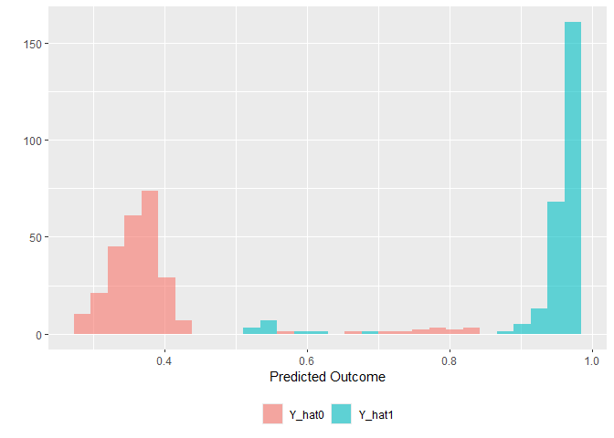
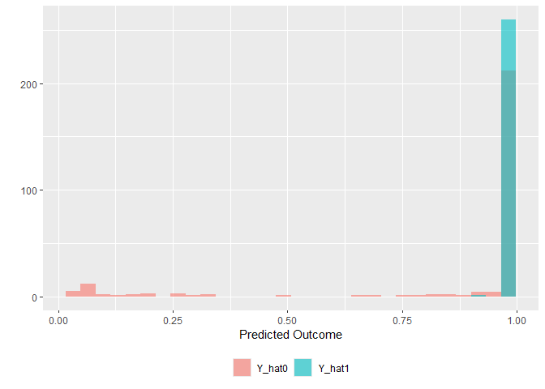

DeepLearningCausal
================
2025-04-26

## Introduction

This is the tutorial for the main functions in the `DeepLearningCausal`
package.

``` r
devtools::install_github("hknd23/DeepLearningCausal",force = TRUE)
install.packages("DeepLearningCausal")
```

``` r
library(DeepLearningCausal)
```

``` r
library(SuperLearner)
```

    ## Loading required package: nnls

    ## Loading required package: gam

    ## Loading required package: splines

    ## Loading required package: foreach

    ## Loaded gam 1.22-5

    ## Super Learner

    ## Version: 2.0-29

    ## Package created on 2024-02-06

``` r
set.seed(123456)
```

## Import Datasets and Model Speficication

``` r
data("exp_data")
data("pop_data")

response_formula <- support_war ~ age + female + education + income +
                    employed + job_loss + hindu + political_ideology
```

## Ensemble Meta Learners

### Ensemble S Learner

``` r
library(DeepLearningCausal)
data("exp_data")
library(SuperLearner)

response_formula <- support_war ~ age + female + education + income +
                    employed + job_loss + hindu + political_ideology
SLlearners = c("SL.xgboost", "SL.ranger", "SL.nnet","SL.glm")
set.seed(123456)

slearner_en <- metalearner_ensemble(cov.formula = response_formula,
               data = exp_data,
               treat.var = "strong_leader",
               meta.learner.type = "S.Learner",
               SL.learners = SLlearners,
               binary.outcome = FALSE)
```

    ## Training model for meta learner

    ##   |                                                          |                                                  |   0%

    ## Training S-Learner

    ## Loading required namespace: xgboost

    ## Loading required namespace: ranger

    ##   |                                                          |==========                                        |  20%  |                                                          |                                                  |   0%

    ## Training S-Learner

    ##   |                                                          |====================                              |  40%  |                                                          |                                                  |   0%

    ## Training S-Learner

    ##   |                                                          |==============================                    |  60%  |                                                          |                                                  |   0%

    ## Training S-Learner

    ##   |                                                          |========================================          |  80%  |                                                          |                                                  |   0%

    ## Training S-Learner

    ##   |                                                          |==================================================| 100%

``` r
print(slearner_en)
```

    ## Method:
    ## Ensemble  S.Learner
    ## Formula:
    ## support_war ~ age + female + education + income + employed +      job_loss + hindu + political_ideology
    ## Treatment Variable:  strong_leader
    ## CATEs percentiles:
    ##          10%          25%          50%          75%          90% 
    ## -0.080797294 -0.038553500 -0.005370921  0.012809736  0.028659600

``` r
plot(slearner_en)
```

    ## `stat_bin()` using `bins = 30`. Pick better value with `binwidth`.

<!-- -->

### Ensemble T Learner

For the T Learner, use `meta.learner.type = "T.Learner"`:

``` r
library(DeepLearningCausal)
data("exp_data")
library(SuperLearner)

response_formula <- support_war ~ age + female + education + income +
                    employed + job_loss + hindu + political_ideology
SLlearners = c("SL.xgboost", "SL.ranger", "SL.nnet","SL.glm")
set.seed(123456)

tlearner_en <- metalearner_ensemble(cov.formula = response_formula,
               data = exp_data,
               treat.var = "strong_leader",
               meta.learner.type = "T.Learner",
               SL.learners = SLlearners,
               binary.outcome = FALSE)
```

    ## Training model for meta learner

    ##   |                                                          |                                                  |   0%

    ## Training T-Learner

    ##   |                                                          |==========                                        |  20%  |                                                          |                                                  |   0%

    ## Training T-Learner

    ##   |                                                          |====================                              |  40%  |                                                          |                                                  |   0%

    ## Training T-Learner

    ##   |                                                          |==============================                    |  60%  |                                                          |                                                  |   0%

    ## Training T-Learner

    ##   |                                                          |========================================          |  80%  |                                                          |                                                  |   0%

    ## Training T-Learner

    ##   |                                                          |==================================================| 100%

``` r
print(tlearner_en)
```

    ## Method:
    ## Ensemble  T.Learner
    ## Formula:
    ## support_war ~ age + female + education + income + employed +      job_loss + hindu + political_ideology
    ## Treatment Variable:  strong_leader
    ## CATEs percentiles:
    ##         10%         25%         50%         75%         90% 
    ## -0.22988514 -0.09762369 -0.00153812  0.06944965  0.15572093

``` r
plot(tlearner_en)
```

    ## `stat_bin()` using `bins = 30`. Pick better value with `binwidth`.

<!-- -->

### Ensemble X Learner

For the X Learner, use `meta.learner.type = "X.Learner"`:

``` r
library(DeepLearningCausal)
data("exp_data")
library(SuperLearner)

response_formula <- support_war ~ age + female + education + income +
                    employed + job_loss + hindu + political_ideology
SLlearners = c("SL.xgboost", "SL.ranger", "SL.nnet","SL.glm")
set.seed(123456)

xlearner_en <- metalearner_ensemble(cov.formula = response_formula,
               data = exp_data,
               treat.var = "strong_leader",
               meta.learner.type = "X.Learner",
               SL.learners = SLlearners,
               binary.outcome = FALSE)
```

    ## Training model for meta learner

    ## Training X-Learner

    ##   |                                                          |                                                  |   0%  |                                                          |==========                                        |  20%  |                                                          |                                                  |   0%  |                                                          |====================                              |  40%  |                                                          |                                                  |   0%  |                                                          |==============================                    |  60%  |                                                          |                                                  |   0%  |                                                          |========================================          |  80%  |                                                          |                                                  |   0%  |                                                          |==================================================| 100%

``` r
print(xlearner_en)
```

    ## Method:
    ## Ensemble  X.Learner
    ## Formula:
    ## support_war ~ age + female + education + income + employed +      job_loss + hindu + political_ideology
    ## Treatment Variable:  strong_leader
    ## CATEs percentiles:
    ##         10%         25%         50%         75%         90% 
    ## -0.40304486 -0.24239673 -0.04533516  0.21475522  0.32371884

``` r
plot(xlearner_en)
```

    ## `stat_bin()` using `bins = 30`. Pick better value with `binwidth`.

<!-- -->

## Deep Neural Meta Learners

### Deep Neural S Learner

``` r
response_formula <- support_war ~ age + female + education + income +
                    employed + job_loss + hindu + political_ideology
set.seed(123456)

slearner_nn <- metalearner_deepneural(cov.formula = response_formula,
               data = exp_data, treat.var = "strong_leader",
               meta.learner.type = "S.Learner",
               stepmax = 1e+9,  algorithm = "rprop+",
               hidden.layer = c(2, 2), linear.output = FALSE,
               binary.outcome = FALSE)
```

    ## Training model for meta learner

    ##   |                                                          |                                                  |   0%  |                                                          |==========                                        |  20%  |                                                          |====================                              |  40%  |                                                          |==============================                    |  60%  |                                                          |========================================          |  80%  |                                                          |==================================================| 100%

``` r
print(slearner_nn)
```

    ## Method:
    ## Deep Neural  S.Learner
    ## Formula:
    ## support_war ~ age + female + education + income + employed +      job_loss + hindu + political_ideology
    ## Treatment Variable:  strong_leader
    ## CATEs percentiles:
    ## 10% 25% 50% 75% 90% 
    ##   0   0   0   0   0

``` r
plot(slearner_nn)
```

    ## `stat_bin()` using `bins = 30`. Pick better value with `binwidth`.

<!-- -->

### Deep Neural T Learner

For the T Learner, use `meta.learner.type = "T.Learner"`:

``` r
response_formula <- support_war ~ age + female + education + income +
                    employed + job_loss + hindu + political_ideology
set.seed(123456)

tlearner_nn <- metalearner_deepneural(cov.formula = response_formula,
               data = exp_data, treat.var = "strong_leader",
               meta.learner.type = "T.Learner", stepmax = 1e+9, 
               hidden.layer = c(2, 2), linear.output = FALSE,
               binary.outcome = FALSE)
```

    ## Training model for meta learner

    ##   |                                                          |                                                  |   0%  |                                                          |==========                                        |  20%  |                                                          |====================                              |  40%  |                                                          |==============================                    |  60%  |                                                          |========================================          |  80%  |                                                          |==================================================| 100%

``` r
print(tlearner_nn)
```

    ## Method:
    ## Deep Neural  T.Learner
    ## Formula:
    ## support_war ~ age + female + education + income + employed +      job_loss + hindu + political_ideology
    ## Treatment Variable:  strong_leader
    ## CATEs percentiles:
    ##         10%         25%         50%         75%         90% 
    ## -0.39385285 -0.18827734 -0.05463520  0.04525315  0.37286898

``` r
plot(tlearner_nn)
```

    ## `stat_bin()` using `bins = 30`. Pick better value with `binwidth`.

<!-- -->

### Deep Neural X Learner

For the X Learner, use `meta.learner.type = "X.Learner"`:

``` r
response_formula <- support_war ~ age + female + education + income +
                    employed + job_loss + hindu + political_ideology
set.seed(123456)

xlearner_nn <- metalearner_deepneural(cov.formula = response_formula,
               data = exp_data, treat.var = "strong_leader",
               meta.learner.type = "X.Learner", stepmax = 1e+9, 
               hidden.layer = c(2, 2), linear.output = FALSE,
               binary.outcome = FALSE)
```

    ## Training model for meta learner

    ##   |                                                          |                                                  |   0%  |                                                          |==========                                        |  20%  |                                                          |====================                              |  40%  |                                                          |==============================                    |  60%  |                                                          |========================================          |  80%  |                                                          |==================================================| 100%

``` r
print(xlearner_nn)
```

    ## Method:
    ## Deep Neural  X.Learner
    ## Formula:
    ## support_war ~ age + female + education + income + employed +      job_loss + hindu + political_ideology
    ## Treatment Variable:  strong_leader
    ## CATEs percentiles:
    ##       10%       25%       50%       75%       90% 
    ## 0.1431044 0.3537234 0.5034391 0.5436359 0.8344527

``` r
plot(xlearner_nn)
```

    ## `stat_bin()` using `bins = 30`. Pick better value with `binwidth`.

<!-- -->

## Ensemble PATT-C

``` r
library(DeepLearningCausal)
data("exp_data")
library(SuperLearner)

response_formula <- support_war ~ age + female + education + income +
                    employed + job_loss + hindu + political_ideology
SLlearners = c("SL.xgboost", "SL.ranger", "SL.nnet","SL.glm")
set.seed(123456)

pattc_en <- pattc_ensemble(response.formula = response_formula,
            exp.data = exp_data, pop.data = pop_data,
            treat.var = "strong_leader", compl.var = "compliance",
            compl.SL.learners = SLlearners,
            response.SL.learners = SLlearners,
            binary.outcome = FALSE, bootstrap = FALSE)
```

    ## Training complier model

    ## Training response model

    ## Predicting response and estimating PATT-C

``` r
print(pattc_en)
```

    ## Method:
    ## Super Learner Ensemble PATT-C
    ## Formula:
    ## support_war ~ age + female + education + income + employed +      job_loss + hindu + political_ideology
    ## Treatment Variable:  strong_leader
    ## Compliance Variable:  compliance
    ## Estimate:
    ##     PATT-C LCI (2.5%) UCI (2.5%) 
    ##  0.5575995  0.5415224  0.5736767 
    ## 
    ## Welch Two Sample t-test

``` r
plot(pattc_en)
```

    ## `stat_bin()` using `bins = 30`. Pick better value with `binwidth`.

<!-- -->

### Bootstrapped Ensemble PATT-C

For bootstrapped PATT-C users can specify arguments `bootstrap = TRUE`
and number of iterations with `nboot = 5000` (default is 1000).

``` r
response_formula <- support_war ~ age + female + education + income +
                    employed + job_loss + hindu + political_ideology
set.seed(123456)

pattc_en_b <- pattc_ensemble(response.formula = response_formula,
            exp.data = exp_data, pop.data = pop_data,
            treat.var = "strong_leader", compl.var = "compliance",
            compl.SL.learners = SLlearners,
            response.SL.learners = SLlearners,
            binary.outcome = FALSE, 
            bootstrap = TRUE, nboot = 5000)
```

    ## Training complier model

    ## Training response model

    ## Predicting response and estimating PATT-C

``` r
print(pattc_en_b)
```

    ## Method:
    ## Super Learner Ensemble PATT-C
    ## Formula:
    ## support_war ~ age + female + education + income + employed +      job_loss + hindu + political_ideology
    ## Treatment Variable:  strong_leader
    ## Compliance Variable:  compliance
    ## Estimate:
    ##     PATT-C LCI (2.5%) UCI (2.5%) 
    ##  0.5576307  0.5410107  0.5730472 
    ## 
    ## Bootstrapped PATT-C with 5000 samples

## Deep Neural PATT-C

``` r
response_formula <- support_war ~ age + female + education + income +
                    employed + job_loss + hindu + political_ideology
set.seed(123456)

pattc_nn <- pattc_deepneural(response.formula = response_formula,
            exp.data = exp_data, pop.data = pop_data,
            treat.var = "strong_leader", compl.var = "compliance",
            compl.hidden.layer = c(2, 2),
            response.hidden.layer = c(2, 2),
            compl.stepmax = 1e+09, response.stepmax = 1e+09,
            binary.outcome = FALSE)
```

    ## Training complier model

    ## Training response model

    ## Predicting response and estimating PATT-C

``` r
print(pattc_nn)
```

    ## Method:
    ## Deep Neural PATT-C
    ## Formula:
    ## support_war ~ age + female + education + income + employed +      job_loss + hindu + political_ideology
    ## Treatment Variable:  strong_leader
    ## Compliance Variable:  compliance
    ## Estimate:
    ##     PATT-C LCI (2.5%) UCI (2.5%) 
    ## 0.11506145 0.08061277 0.14951013 
    ## 
    ## Welch Two Sample t-test

``` r
plot(pattc_nn)
```

    ## `stat_bin()` using `bins = 30`. Pick better value with `binwidth`.

<!-- -->

### Bootstrapped Deep Neural PATT-C

For bootstrapped PATT-C, use `bootstrap = TRUE` and number of iterations
with `nboot = 5000`.

``` r
response_formula <- support_war ~ age + female + education + income +
                    employed + job_loss + hindu + political_ideology
set.seed(123456)

pattc_nn_b <- pattc_deepneural(response.formula = response_formula,
              exp.data = exp_data, pop.data = pop_data,
              treat.var = "strong_leader", compl.var = "compliance",
              compl.hidden.layer = c(2, 2),
              response.hidden.layer = c(2, 2),
              compl.stepmax = 1e+09, response.stepmax = 1e+09,
              binary.outcome = FALSE, 
              bootstrap = TRUE, nboot = 5000)
```

    ## Training complier model

    ## Training response model

    ## Predicting response and estimating PATT-C

``` r
print(pattc_nn_b)
```

    ## Method:
    ## Deep Neural PATT-C
    ## Formula:
    ## support_war ~ age + female + education + income + employed +      job_loss + hindu + political_ideology
    ## Treatment Variable:  strong_leader
    ## Compliance Variable:  compliance
    ## Estimate:
    ##     PATT-C LCI (2.5%) UCI (2.5%) 
    ## 0.11479795 0.08213788 0.15084056 
    ## 
    ## Bootstrapped PATT-C with 5000 samples

## Subgroup HTE Plots

Subgroup analyses using CATEs from meta learners and PATT-C predictions
can be performed using `hte_plot`:

``` r
hte_plot(xlearner_nn, cut_points = c(20, .5, 3, 3, .5, 2, .5, 6), boot = TRUE,
         n_boot = 1000)
```

<!-- -->
