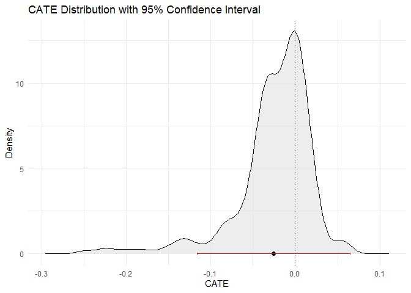
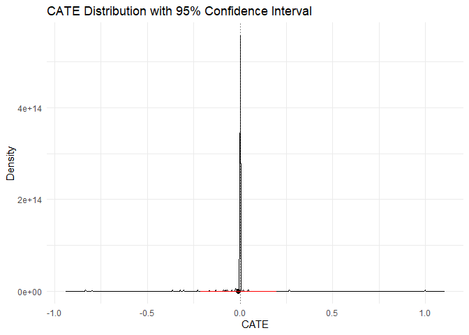
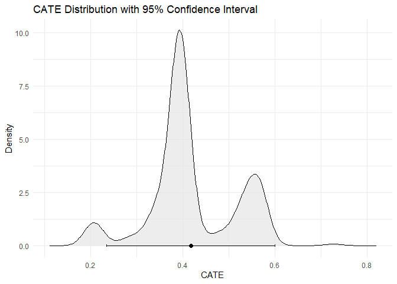
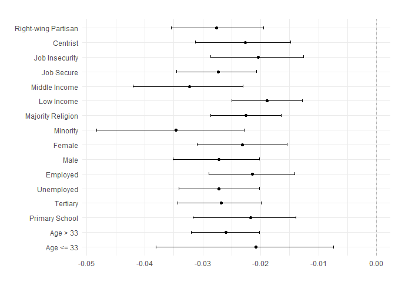
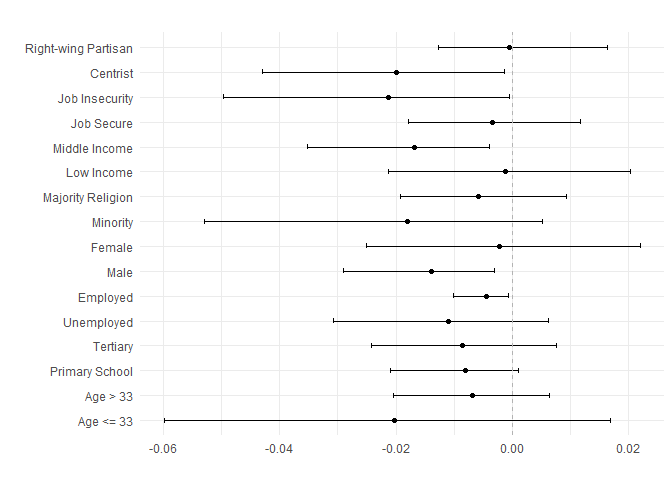
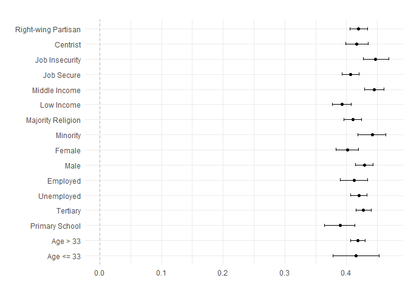
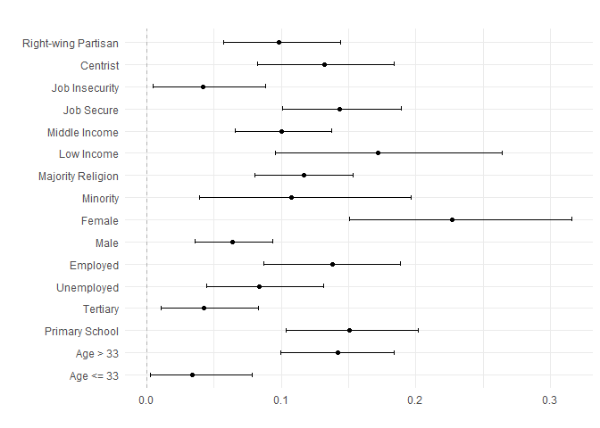

DeepLearningCausal
================
2025-11-02

## Introduction

This is the tutorial for the functions in the `DeepLearningCausal`
package using the ensemble method from SuperLearner and neural network
based on neuralnet.

``` r
devtools::install_github("hknd23/DeepLearningCausal",force = TRUE)
install.packages("DeepLearningCausal")
```

``` r
library(DeepLearningCausal)
```

    ## Install Python from https://www.python.org/ and use `python_ready()` to enable all features.

``` r
library(SuperLearner)
```

    ## Loading required package: nnls

    ## Loading required package: gam

    ## Loading required package: splines

    ## Loading required package: foreach

    ## Loaded gam 1.22-5

    ## Super Learner

    ## Version: 2.0-29

    ## Package created on 2024-02-06

``` r
set.seed(123456)
```

## Import Datasets and Model Speficication

``` r
data("exp_data")
data("pop_data")

response_formula <- support_war ~ age + female + education + income +
                    employed + job_loss + hindu + political_ideology
```

## Ensemble Meta Learners

### Ensemble S Learner

``` r
library(DeepLearningCausal)
data("exp_data")
library(SuperLearner)

response_formula <- support_war ~ age + female + education + income +
                    employed + job_loss + hindu + political_ideology
SLlearners = c("SL.xgboost", "SL.ranger", "SL.nnet","SL.glm")
set.seed(123456)

slearner_en <- metalearner_ensemble(cov.formula = response_formula,
               data = exp_data,
               treat.var = "strong_leader",
               meta.learner.type = "S.Learner",
               SL.learners = SLlearners)
```

    ## Running in Cross-Validation mode

    ## Training model for meta learner

    ##   |                                                          |                                                  |   0%

    ## Training S-Learner

    ## Loading required namespace: xgboost

    ## Loading required namespace: ranger

    ##   |                                                          |==========                                        |  20%  |                                                          |                                                  |   0%

    ## Training S-Learner

    ##   |                                                          |====================                              |  40%  |                                                          |                                                  |   0%

    ## Training S-Learner

    ##   |                                                          |==============================                    |  60%  |                                                          |                                                  |   0%

    ## Training S-Learner

    ##   |                                                          |========================================          |  80%  |                                                          |                                                  |   0%

    ## Training S-Learner

    ##   |                                                          |==================================================| 100%

``` r
print(slearner_en)
```

    ## Method:
    ## Ensemble  S.Learner
    ## Formula:
    ## support_war ~ age + female + education + income + employed +      job_loss + hindu + political_ideology
    ## Treatment Variable:  strong_leader
    ## CATEs percentiles:
    ##         10%         25%         50%         75%         90% 
    ## -0.02959346 -0.01185148  0.01118029  0.02882837  0.04959181

``` r
plot(slearner_en)
```

    ## Warning: The dot-dot notation (`..density..`) was deprecated in ggplot2 3.4.0.
    ## ℹ Please use `after_stat(density)` instead.
    ## ℹ The deprecated feature was likely used in the DeepLearningCausal package.
    ##   Please report the issue at
    ##   <https://github.com/hknd23/DeepLearningCausal/issues>.
    ## This warning is displayed once every 8 hours.
    ## Call `lifecycle::last_lifecycle_warnings()` to see where this warning was
    ## generated.

    ## `height` was translated to `width`.

<!-- -->

### Ensemble T Learner

For the T Learner, use `meta.learner.type = "T.Learner"`:

``` r
library(DeepLearningCausal)
data("exp_data")
library(SuperLearner)

response_formula <- support_war ~ age + female + education + income +
                    employed + job_loss + hindu + political_ideology
SLlearners = c("SL.xgboost", "SL.ranger", "SL.nnet","SL.glm")
set.seed(123456)

tlearner_en <- metalearner_ensemble(cov.formula = response_formula,
               data = exp_data,
               treat.var = "strong_leader",
               meta.learner.type = "T.Learner",
               SL.learners = SLlearners)
```

    ## Running in Cross-Validation mode

    ## Training model for meta learner

    ##   |                                                          |                                                  |   0%

    ## Training T-Learner

    ##   |                                                          |==========                                        |  20%  |                                                          |                                                  |   0%

    ## Training T-Learner

    ##   |                                                          |====================                              |  40%  |                                                          |                                                  |   0%

    ## Training T-Learner

    ##   |                                                          |==============================                    |  60%  |                                                          |                                                  |   0%

    ## Training T-Learner

    ##   |                                                          |========================================          |  80%  |                                                          |                                                  |   0%

    ## Training T-Learner

    ##   |                                                          |==================================================| 100%

``` r
print(tlearner_en)
```

    ## Method:
    ## Ensemble  T.Learner
    ## Formula:
    ## support_war ~ age + female + education + income + employed +      job_loss + hindu + political_ideology
    ## Treatment Variable:  strong_leader
    ## CATEs percentiles:
    ##           10%           25%           50%           75%           90% 
    ## -0.2389880026 -0.1212091523 -0.0009183178  0.1243237099  0.2535340886

``` r
plot(tlearner_en)
```

    ## `height` was translated to `width`.

<!-- -->

### Ensemble X Learner

For the X Learner, use `meta.learner.type = "X.Learner"`:

``` r
library(DeepLearningCausal)
data("exp_data")
library(SuperLearner)

response_formula <- support_war ~ age + female + education + income +
                    employed + job_loss + hindu + political_ideology
SLlearners = c("SL.xgboost", "SL.ranger", "SL.nnet","SL.glm")
set.seed(123456)

xlearner_en <- metalearner_ensemble(cov.formula = response_formula,
               data = exp_data,
               treat.var = "strong_leader",
               meta.learner.type = "X.Learner",
               SL.learners = SLlearners)
```

    ## Running in Cross-Validation mode

    ## Training model for meta learner

    ## Training X-Learner

    ##   |                                                          |                                                  |   0%  |                                                          |==========                                        |  20%  |                                                          |====================                              |  40%  |                                                          |==============================                    |  60%  |                                                          |========================================          |  80%  |                                                          |==================================================| 100%

``` r
print(xlearner_en)
```

    ## Method:
    ## Ensemble  X.Learner
    ## Formula:
    ## support_war ~ age + female + education + income + employed +      job_loss + hindu + political_ideology
    ## Treatment Variable:  strong_leader
    ## CATEs percentiles:
    ##         10%         25%         50%         75%         90% 
    ## -0.23516187 -0.10964764  0.03234184  0.18486392  0.32023225

``` r
plot(xlearner_en)
```

    ## `height` was translated to `width`.

<!-- -->

### Ensemble R Learner

For the R Learner, use `meta.learner.type = "R.Learner"`:

``` r
library(DeepLearningCausal)
data("exp_data")
library(SuperLearner)

response_formula <- support_war ~ age + female + education + income +
                    employed + job_loss + hindu + political_ideology
SLlearners = c("SL.xgboost", "SL.ranger", "SL.nnet","SL.glm")
set.seed(123456)

rlearner_en <- metalearner_ensemble(cov.formula = response_formula,
               data = exp_data,
               treat.var = "strong_leader",
               meta.learner.type = "R.Learner",
               SL.learners = SLlearners)
```

    ## Running in Cross-Validation mode

    ## Training model for meta learner

    ## Training R-Learner

    ##   |                                                          |                                                  |   0%  |                                                          |==========                                        |  20%  |                                                          |====================                              |  40%  |                                                          |==============================                    |  60%  |                                                          |========================================          |  80%  |                                                          |==================================================| 100%

``` r
print(rlearner_en)
```

    ## Method:
    ## Ensemble  R.Learner
    ## Formula:
    ## support_war ~ age + female + education + income + employed +      job_loss + hindu + political_ideology
    ## Treatment Variable:  strong_leader
    ## CATEs percentiles:
    ##         10%         25%         50%         75%         90% 
    ## 0.005764937 0.089705774 0.210802514 0.344399978 0.362500554

``` r
plot(rlearner_en)
```

    ## `height` was translated to `width`.

<!-- -->

## Deep Neural Meta Learners

### Deep Neural S Learner

``` r
response_formula <- support_war ~ age + female + education + income +
                    employed + job_loss + hindu + political_ideology
set.seed(123456)

slearner_nn <- metalearner_neural(cov.formula = response_formula,
               data = exp_data, treat.var = "strong_leader",
               meta.learner.type = "S.Learner",
               stepmax = 1e+9,  algorithm = "rprop+",
               hidden.layer = c(1, 1), linear.output = FALSE)
```

    ## Training model for meta learner

    ##   |                                                          |                                                  |   0%  |                                                          |==========                                        |  20%  |                                                          |====================                              |  40%  |                                                          |==============================                    |  60%  |                                                          |========================================          |  80%  |                                                          |==================================================| 100%

``` r
print(slearner_nn)
```

    ## Method:
    ## Deep Neural  S.Learner
    ## Formula:
    ## support_war ~ age + female + education + income + employed +      job_loss + hindu + political_ideology
    ## Treatment Variable:  strong_leader
    ## CATEs percentiles:
    ##           10%           25%           50%           75%           90% 
    ## -2.840946e-08  0.000000e+00  0.000000e+00  0.000000e+00  0.000000e+00

``` r
plot(slearner_nn)
```

    ## `height` was translated to `width`.

<!-- -->

### Deep Neural T Learner

For the T Learner, use `meta.learner.type = "T.Learner"`:

``` r
response_formula <- support_war ~ age + female + education + income +
                    employed + job_loss + hindu + political_ideology
set.seed(123456)

tlearner_nn <- metalearner_neural(cov.formula = response_formula,
               data = exp_data, treat.var = "strong_leader",
               meta.learner.type = "T.Learner", stepmax = 1e+9, 
               hidden.layer = c(1, 1), linear.output = FALSE)
```

    ## Training model for meta learner

    ##   |                                                          |                                                  |   0%  |                                                          |==========                                        |  20%  |                                                          |====================                              |  40%  |                                                          |==============================                    |  60%  |                                                          |========================================          |  80%  |                                                          |==================================================| 100%

``` r
print(tlearner_nn)
```

    ## Method:
    ## Deep Neural  T.Learner
    ## Formula:
    ## support_war ~ age + female + education + income + employed +      job_loss + hindu + political_ideology
    ## Treatment Variable:  strong_leader
    ## CATEs percentiles:
    ##         10%         25%         50%         75%         90% 
    ## -0.29119025 -0.02490470  0.03884904  0.05443311  0.13372127

``` r
plot(tlearner_nn)
```

    ## `height` was translated to `width`.

<!-- -->

### Deep Neural X Learner

For the X Learner, use `meta.learner.type = "X.Learner"`:

``` r
response_formula <- support_war ~ age + female + education + income +
                    employed + job_loss + hindu + political_ideology
set.seed(123456)

xlearner_nn <- metalearner_neural(cov.formula = response_formula,
               data = exp_data, treat.var = "strong_leader",
               meta.learner.type = "X.Learner", stepmax = 1e+9, 
               hidden.layer = c(1, 1), linear.output = FALSE)
```

    ## Training model for meta learner

    ##   |                                                          |                                                  |   0%  |                                                          |==========                                        |  20%  |                                                          |====================                              |  40%  |                                                          |==============================                    |  60%  |                                                          |========================================          |  80%  |                                                          |==================================================| 100%

``` r
print(xlearner_nn)
```

    ## Method:
    ## Deep Neural  X.Learner
    ## Formula:
    ## support_war ~ age + female + education + income + employed +      job_loss + hindu + political_ideology
    ## Treatment Variable:  strong_leader
    ## CATEs percentiles:
    ##       10%       25%       50%       75%       90% 
    ## 0.3173252 0.3563699 0.5290992 0.5937625 0.6316168

``` r
plot(xlearner_nn)
```

    ## `height` was translated to `width`.

    ## Warning: Removed 1 row containing missing values or values outside the scale range
    ## (`geom_vline()`).

<!-- --> \### Deep Neural
R Learner For the R Learner, use `meta.learner.type = "R.Learner"`:

``` r
response_formula <- support_war ~ age + female + education + income +
                    employed + job_loss + hindu + political_ideology
set.seed(123456)

rlearner_nn <- metalearner_neural(cov.formula = response_formula,
               data = exp_data, treat.var = "strong_leader",
               meta.learner.type = "R.Learner", stepmax = 1e+9, 
               hidden.layer = c(1, 1), linear.output = FALSE)
```

    ## Training model for meta learner

    ##   |                                                          |                                                  |   0%  |                                                          |                                                  |   0%  |                                                          |==========                                        |  20%  |                                                          |====================                              |  40%  |                                                          |==============================                    |  60%  |                                                          |========================================          |  80%  |                                                          |==================================================| 100%

``` r
print(rlearner_nn)
```

    ## Method:
    ## Deep Neural  R.Learner
    ## Formula:
    ## support_war ~ age + female + education + income + employed +      job_loss + hindu + political_ideology
    ## Treatment Variable:  strong_leader
    ## CATEs percentiles:
    ##        10%        25%        50%        75%        90% 
    ## 0.05853159 0.05854650 0.07300735 0.07300735 0.25813744

``` r
plot(rlearner_nn)
```

    ## `height` was translated to `width`.

<!-- -->

## Ensemble PATT-C

``` r
library(DeepLearningCausal)
data("exp_data")
library(SuperLearner)

response_formula <- support_war ~ age + female + education + income +
                    employed + job_loss + hindu + political_ideology
SLlearners = c("SL.nnet","SL.glm")
set.seed(123456)

pattc_en <- pattc_ensemble(response.formula = response_formula,
                           exp.data = exp_data, 
                           pop.data = pop_data,
                           treat.var = "strong_leader", 
                           compl.var = "compliance", 
                           compl.SL.learners = SLlearners,
                           response.SL.learners = SLlearners,
                           response.family = binomial(),
                           binary.preds = FALSE, 
                           bootstrap = TRUE,
                           nboot = 1000)
```

    ## Training complier model

    ## Training response model

    ## Predicting response and estimating PATT-C

``` r
print(pattc_en)
```

    ## Method:
    ## Super Learner Ensemble PATT-C
    ## Formula:
    ## support_war ~ age + female + education + income + employed +      job_loss + hindu + political_ideology
    ## Treatment Variable:  strong_leader
    ## Compliance Variable:  compliance
    ## Estimate:
    ##     PATT-C LCI (2.5%) UCI (2.5%) 
    ## 0.08541226 0.08114700 0.08993381 
    ## 
    ## Bootstrapped PATT-C with 1000 samples

``` r
plot(pattc_en)
```

<!-- -->

### Deep Neural PATT-C

For bootstrapped PATT-C, use `bootstrap = TRUE` and number of iterations
with `nboot = 5000`.

``` r
response_formula <- support_war ~ age + female + education + income +
                    employed + job_loss + hindu + political_ideology
set.seed(123456)

pattc_nn <- pattc_neural(response.formula = response_formula,
              exp.data = exp_data, pop.data = pop_data,
              treat.var = "strong_leader", compl.var = "compliance",
              compl.hidden.layer = c(1, 1),
              response.hidden.layer = c(1, 1),
              compl.stepmax = 1e+09, response.stepmax = 1e+09, bootstrap = TRUE,
              nboot = 1000, binary.preds = FALSE)
```

    ## Training complier model

    ## Training response model

    ## Predicting response and estimating PATT-C

``` r
print(pattc_nn)
```

    ## Method:
    ## Deep Neural PATT-C
    ## Formula:
    ## support_war ~ age + female + education + income + employed +      job_loss + hindu + political_ideology
    ## Treatment Variable:  strong_leader
    ## Compliance Variable:  compliance
    ## Estimate:
    ##       PATT-C   LCI (2.5%)   UCI (2.5%) 
    ## -0.016152553 -0.023389420 -0.008879787 
    ## 
    ## Bootstrapped PATT-C with 1000 samples

## Subgroup HTE Plots

Subgroup analyses using CATEs from meta learners and PATT-C predictions
can be performed using `hte_plot`. `cut_points` specifies the cut-off
points for subgroups. If a covariate is binary, the value for its cut
off should be between 0-1.

``` r
cuts = c(20, .5, 3, 3, .5, 2, .5, 6)

labels <- c("Age <= 33", "Age > 33", "Primary School", "Tertiary", "Unemployed",         
            "Employed", "Male", "Female",  "Minority", "Majority Religion" ,
            "Low Income",  "Middle Income",  "Job Secure",  "Job Insecurity",
            "Centrist", "Right-wing Partisan")
```

``` r
hte_plot(slearner_en, cut_points = cuts, custom_labels = labels, boot = TRUE,
         n_boot = 1000)
```

    ## `height` was translated to `width`.

<!-- -->

``` r
hte_plot(rlearner_en, cut_points = cuts, custom_labels = labels, boot = TRUE,
         n_boot = 1000)
```

    ## `height` was translated to `width`.

<!-- -->

``` r
hte_plot(slearner_nn, cut_points = cuts, custom_labels = labels, boot = TRUE,
         n_boot = 1000)
```

    ## `height` was translated to `width`.

<!-- -->

``` r
hte_plot(rlearner_nn, cut_points = cuts, custom_labels = labels, boot = TRUE,
         n_boot = 1000)
```

    ## `height` was translated to `width`.

<!-- -->

``` r
hte_plot(pattc_en, cut_points = cuts, custom_labels = labels, boot = TRUE,
         n_boot = 1000)
```

    ## `height` was translated to `width`.

<!-- -->

``` r
hte_plot(pattc_nn, cut_points = cuts, custom_labels = labels, boot = TRUE,
         n_boot = 1000)
```

    ## `height` was translated to `width`.

<!-- -->
