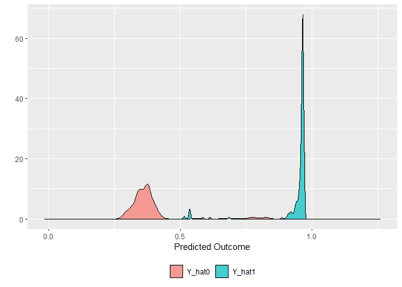

DeepLearningCausal
================
2024-07-13

## Introduction

This is the tutorial for the main functions in the `DeepLearningCausal`
package.

``` r
devtools::install_github("hknd23/DeepLearningCausal",force = TRUE)
```

    ## Downloading GitHub repo hknd23/DeepLearningCausal@HEAD

    ## stringi   (1.7.8  -> 1.8.4 ) [CRAN]
    ## cli       (3.6.0  -> 3.6.3 ) [CRAN]
    ## purrr     (1.0.1  -> 1.0.2 ) [CRAN]
    ## glue      (1.6.2  -> 1.7.0 ) [CRAN]
    ## rlang     (1.1.0  -> 1.1.4 ) [CRAN]
    ## broom     (1.0.0  -> 1.0.6 ) [CRAN]
    ## fs        (1.5.2  -> 1.6.4 ) [CRAN]
    ## cachem    (1.0.6  -> 1.1.0 ) [CRAN]
    ## yaml      (2.3.5  -> 2.3.9 ) [CRAN]
    ## xfun      (0.31   -> 0.45  ) [CRAN]
    ## fastmap   (1.1.0  -> 1.2.0 ) [CRAN]
    ## digest    (0.6.33 -> 0.6.36) [CRAN]
    ## knitr     (1.39   -> 1.48  ) [CRAN]
    ## rmarkdown (2.14   -> 2.27  ) [CRAN]

    ## Installing 14 packages: stringi, cli, purrr, glue, rlang, broom, fs, cachem, yaml, xfun, fastmap, digest, knitr, rmarkdown

    ## Installing packages into 'C:/Users/nguye/AppData/Local/R/win-library/4.2'
    ## (as 'lib' is unspecified)

    ## 
    ##   There are binary versions available but the source versions are later:
    ##           binary source needs_compilation
    ## stringi    1.8.3  1.8.4              TRUE
    ## cli        3.6.2  3.6.3              TRUE
    ## rlang      1.1.3  1.1.4              TRUE
    ## broom      1.0.5  1.0.6             FALSE
    ## fs         1.6.3  1.6.4              TRUE
    ## cachem     1.0.8  1.1.0              TRUE
    ## yaml       2.3.8  2.3.9              TRUE
    ## xfun        0.43   0.45              TRUE
    ## fastmap    1.1.1  1.2.0              TRUE
    ## digest    0.6.35 0.6.36              TRUE
    ## knitr       1.46   1.48             FALSE
    ## rmarkdown   2.26   2.27             FALSE
    ## 
    ## package 'purrr' successfully unpacked and MD5 sums checked
    ## package 'glue' successfully unpacked and MD5 sums checked
    ## 
    ## The downloaded binary packages are in
    ##  C:\Users\nguye\AppData\Local\Temp\RtmpmuGP6B\downloaded_packages

    ## installing the source packages 'stringi', 'cli', 'rlang', 'broom', 'fs', 'cachem', 'yaml', 'xfun', 'fastmap', 'digest', 'knitr', 'rmarkdown'

    ## ── R CMD build ─────────────────────────────────────────────────────────────────
    ##          checking for file 'C:\Users\nguye\AppData\Local\Temp\RtmpmuGP6B\remotes305c379c620f\hknd23-DeepLearningCausal-365acae/DESCRIPTION' ...  ✔  checking for file 'C:\Users\nguye\AppData\Local\Temp\RtmpmuGP6B\remotes305c379c620f\hknd23-DeepLearningCausal-365acae/DESCRIPTION'
    ##       ─  preparing 'DeepLearningCausal': (455ms)
    ##    checking DESCRIPTION meta-information ...  ✔  checking DESCRIPTION meta-information
    ##       ─  checking for LF line-endings in source and make files and shell scripts
    ##   ─  checking for empty or unneeded directories
    ##   ─  building 'DeepLearningCausal_0.0.104.tar.gz'
    ##      
    ## 

    ## Installing package into 'C:/Users/nguye/AppData/Local/R/win-library/4.2'
    ## (as 'lib' is unspecified)

``` r
library(DeepLearningCausal)
```

``` r
install.packages("DeepLearningCausal")
```

``` r
library(SuperLearner)
```

    ## Loading required package: nnls

    ## Loading required package: gam

    ## Loading required package: splines

    ## Loading required package: foreach

    ## Loaded gam 1.22-3

    ## Super Learner

    ## Version: 2.0-29

    ## Package created on 2024-02-06

``` r
set.seed(123456)
```

## Import Datasets and Model Speficication

``` r
data("exp_data")
data("pop_data")

response_formula <- support_war ~ age + female + education + income +
                    employed + job_loss + hindu + political_ideology
```

## Ensemble Meta Learners

### Ensemble S Learner

``` r
library(DeepLearningCausal)
data("exp_data")
library(SuperLearner)

response_formula <- support_war ~ age + female + education + income +
                    employed + job_loss + hindu + political_ideology
SLlearners = c("SL.xgboost", "SL.ranger", "SL.nnet","SL.glm")
set.seed(123456)

slearner_en <- metalearner_ensemble(cov.formula = response_formula,
               data = exp_data,
               treat.var = "strong_leader",
               meta.learner.type = "S.Learner",
               SL.learners = SLlearners,
               binary.outcome = FALSE)
```

    ## Training model for meta learner

    ##   |                                                          |                                                  |   0%

    ## Loading required namespace: xgboost

    ## Loading required namespace: ranger

    ##   |                                                          |==========                                        |  20%  |                                                          |                                                  |   0%  |                                                          |====================                              |  40%  |                                                          |                                                  |   0%  |                                                          |==============================                    |  60%  |                                                          |                                                  |   0%  |                                                          |========================================          |  80%  |                                                          |                                                  |   0%  |                                                          |==================================================| 100%

``` r
print(slearner_en)
```

    ## Method:
    ## Ensemble  S.LearnerFormula:
    ## support_war ~ age + female + education + income + employed +      job_loss + hindu + political_ideology
    ## Treatment Variable:  strong_leader
    ## CATEs percentiles:
    ##          10%          25%          50%          75%          90% 
    ## -0.080797294 -0.038553500 -0.005370921  0.012809736  0.028659600

### Ensemble T Learner

For the T Learner, use `meta.learner.type = "T.Learner"`:

``` r
library(DeepLearningCausal)
data("exp_data")
library(SuperLearner)

response_formula <- support_war ~ age + female + education + income +
                    employed + job_loss + hindu + political_ideology
SLlearners = c("SL.xgboost", "SL.ranger", "SL.nnet","SL.glm")
set.seed(123456)

tlearner_en <- metalearner_ensemble(cov.formula = response_formula,
               data = exp_data,
               treat.var = "strong_leader",
               meta.learner.type = "T.Learner",
               SL.learners = SLlearners,
               binary.outcome = FALSE)
```

    ## Training model for meta learner

    ##   |                                                          |                                                  |   0%  |                                                          |==========                                        |  20%  |                                                          |                                                  |   0%  |                                                          |====================                              |  40%  |                                                          |                                                  |   0%  |                                                          |==============================                    |  60%  |                                                          |                                                  |   0%  |                                                          |========================================          |  80%  |                                                          |                                                  |   0%  |                                                          |==================================================| 100%

``` r
print(slearner_en)
```

    ## Method:
    ## Ensemble  S.LearnerFormula:
    ## support_war ~ age + female + education + income + employed +      job_loss + hindu + political_ideology
    ## Treatment Variable:  strong_leader
    ## CATEs percentiles:
    ##          10%          25%          50%          75%          90% 
    ## -0.080797294 -0.038553500 -0.005370921  0.012809736  0.028659600

``` r
library(ggplot2)
```

    ## Warning: package 'ggplot2' was built under R version 4.2.3

``` r
library(dplyr)
```

    ## Warning: package 'dplyr' was built under R version 4.2.3

    ## 
    ## Attaching package: 'dplyr'

    ## The following objects are masked from 'package:stats':
    ## 
    ##     filter, lag

    ## The following objects are masked from 'package:base':
    ## 
    ##     intersect, setdiff, setequal, union

``` r
data.frame(tlearner_en$CATEs) %>% ggplot( aes(x= tlearner_en.CATEs)) +
  geom_histogram(alpha = 0.6, position = 'identity') +
  xlab("CATEs (T Learner)")+ylab("")
```

    ## `stat_bin()` using `bins = 30`. Pick better value with `binwidth`.

<!-- -->

``` r
data.frame(tlearner_en$CATEs) %>% ggplot( aes(x= tlearner_en.CATEs)) +
  geom_histogram(alpha = 0.6, position = 'identity')+
  xlab("CATEs (S Learner)")+ylab("")
```

    ## `stat_bin()` using `bins = 30`. Pick better value with `binwidth`.

<!-- --> \## Deep Neural
Meta Learners

### Deep Neural S Learner

``` r
response_formula <- support_war ~ age + female + education + income +
                    employed + job_loss + hindu + political_ideology
set.seed(123456)

slearner_nn <- metalearner_deepneural(cov.formula = response_formula,
               data = exp_data, treat.var = "strong_leader",
               meta.learner.type = "S.Learner",
               stepmax = 1e+9,  algorithm = "rprop+",
               hidden.layer = c(2, 2), linear.output = FALSE,
               binary.outcome = FALSE)
```

    ## Training model for meta learner

    ##   |                                                          |                                                  |   0%  |                                                          |==========                                        |  20%  |                                                          |====================                              |  40%  |                                                          |==============================                    |  60%  |                                                          |========================================          |  80%  |                                                          |==================================================| 100%

``` r
print(slearner_nn)
```

    ## Method:
    ## Deep Neural  S.LearnerFormula:
    ## support_war ~ age + female + education + income + employed +      job_loss + hindu + political_ideology
    ## Treatment Variable:  strong_leader
    ## CATEs percentiles:
    ## 10% 25% 50% 75% 90% 
    ##   0   0   0   0   0

### Deep Neural T Learner

For the T Learner, use `meta.learner.type = "T.Learner"`:

``` r
response_formula <- support_war ~ age + female + education + income +
                    employed + job_loss + hindu + political_ideology
set.seed(123456)

tlearner_nn <- metalearner_deepneural(cov.formula = response_formula,
               data = exp_data, treat.var = "strong_leader",
               meta.learner.type = "T.Learner", stepmax = 1e+9, 
               hidden.layer = c(2, 2), linear.output = FALSE,
               binary.outcome = FALSE)
```

    ## Training model for meta learner

    ##   |                                                          |                                                  |   0%  |                                                          |==========                                        |  20%  |                                                          |====================                              |  40%  |                                                          |==============================                    |  60%  |                                                          |========================================          |  80%  |                                                          |==================================================| 100%

``` r
print(tlearner_nn)
```

    ## Method:
    ## Deep Neural  T.LearnerFormula:
    ## support_war ~ age + female + education + income + employed +      job_loss + hindu + political_ideology
    ## Treatment Variable:  strong_leader
    ## CATEs percentiles:
    ##         10%         25%         50%         75%         90% 
    ## -0.39385285 -0.18827734 -0.05463520  0.04525315  0.37286898

``` r
library(ggplot2)

data.frame(slearner_nn$CATEs) %>% ggplot( aes(x= slearner_nn.CATEs)) +
  geom_histogram(alpha = 0.6, position = 'identity') +
  xlab("CATEs (T Learner)")+ylab("")
```

    ## `stat_bin()` using `bins = 30`. Pick better value with `binwidth`.

<!-- -->

``` r
data.frame(tlearner_nn$CATEs) %>% ggplot( aes(x= tlearner_nn.CATEs)) +
  geom_histogram(alpha = 0.6, position = 'identity')+
  xlab("CATEs (S Learner)")+ylab("")
```

    ## `stat_bin()` using `bins = 30`. Pick better value with `binwidth`.

<!-- --> \## Ensemble
PATT-C

``` r
library(DeepLearningCausal)
data("exp_data")
library(SuperLearner)

response_formula <- support_war ~ age + female + education + income +
                    employed + job_loss + hindu + political_ideology
SLlearners = c("SL.xgboost", "SL.ranger", "SL.nnet","SL.glm")
set.seed(123456)

pattc_en <- pattc_ensemble(response.formula = response_formula,
            exp.data = exp_data, pop.data = pop_data,
            treat.var = "strong_leader", compl.var = "compliance",
            SL.learners = SLlearners,
            binary.outcome = FALSE, bootstrap = FALSE)
```

    ## Training complier model

    ## Training response model

    ## Predicting response and estimating PATT-C

``` r
print(pattc_en)
```

    ## Method:
    ## Super Learner Ensemble PATT-C
    ## Formula:
    ## support_war ~ age + female + education + income + employed +      job_loss + hindu + political_ideology
    ## Treatment Variable:  strong_leader
    ## Compliance Variable:  compliance
    ## Estimate:
    ##     PATT-C LCI (2.5%) UCI (2.5%) 
    ##  0.5575995  0.5415224  0.5736767 
    ## 
    ## Welch Two Sample t-test

``` r
library(ggplot2)
patt_en_preds <-  rbind(data.frame("predictions" = pattc_en$pop_counterfactual[,1],
                                   type = "Y_hat0"),
                        data.frame("predictions" = pattc_en$pop_counterfactual[,2],
                                   type = "Y_hat1"))
patt_en_preds %>%
  ggplot( aes(x = predictions, fill = type)) +
  geom_histogram(alpha = 0.6, position = 'identity')+xlab("Predicted Outcome")+ylab("")+
  theme(legend.position = "bottom")+
  theme(legend.title=element_blank())
```

    ## `stat_bin()` using `bins = 30`. Pick better value with `binwidth`.

<!-- --> \### Bootstrapped
Ensemble PATT-C

For bootstrapped PATT-C users can specify arguments `bootstrap = TRUE`
and number of iterations with `nboot = 5000` (default is 1000).

``` r
response_formula <- support_war ~ age + female + education + income +
                    employed + job_loss + hindu + political_ideology
set.seed(123456)

pattc_en_b <- pattc_ensemble(response.formula = response_formula,
            exp.data = exp_data, pop.data = pop_data,
            treat.var = "strong_leader", compl.var = "compliance",
            SL.learners = SLlearners,
            binary.outcome = FALSE, 
            bootstrap = TRUE, nboot = 5000)
```

    ## Training complier model

    ## Training response model

    ## Predicting response and estimating PATT-C

``` r
print(pattc_en_b)
```

    ## Method:
    ## Super Learner Ensemble PATT-C
    ## Formula:
    ## support_war ~ age + female + education + income + employed +      job_loss + hindu + political_ideology
    ## Treatment Variable:  strong_leader
    ## Compliance Variable:  compliance
    ## Estimate:
    ##     PATT-C LCI (2.5%) UCI (2.5%) 
    ##  0.5576307  0.5410107  0.5730472 
    ## 
    ## Bootstrapped PATT-C with 5000 samples

## Deep Neural PATT-C

``` r
response_formula <- support_war ~ age + female + education + income +
                    employed + job_loss + hindu + political_ideology
set.seed(123456)

pattc_nn <- pattc_deepneural(response.formula = response_formula,
            exp.data = exp_data, pop.data = pop_data,
            treat.var = "strong_leader", compl.var = "compliance",
            compl.hidden.layer = c(2, 2),
            response.hidden.layer = c(2, 2),
            compl.stepmax = 1e+09, response.stepmax = 1e+09,
            binary.outcome = FALSE)
```

    ## Training complier model

    ## Training response model

    ## Predicting response and estimating PATT-C

``` r
print(pattc_nn)
```

    ## Method:
    ## Deep Neural PATT-C
    ## Formula:
    ## support_war ~ age + female + education + income + employed +      job_loss + hindu + political_ideology
    ## Treatment Variable:  strong_leader
    ## Compliance Variable:  compliance
    ## Estimate:
    ##     PATT-C LCI (2.5%) UCI (2.5%) 
    ## 0.11506145 0.08061277 0.14951013 
    ## 
    ## Welch Two Sample t-test

``` r
library(ggplot2)
patt_nn_preds <-  rbind(data.frame("predictions" = pattc_nn$pop_counterfactual[,1],
                                   type = "Y_hat0"),
                        data.frame("predictions" = pattc_nn$pop_counterfactual[,2],
                                   type = "Y_hat1"))

patt_nn_preds %>%
  ggplot( aes(x = predictions, fill = type)) +
  geom_histogram(alpha = 0.6, position = 'identity')+
  xlab("Predicted Outcome")+ylab("")+
  theme(legend.position = "bottom")+
  theme(legend.title=element_blank())
```

    ## `stat_bin()` using `bins = 30`. Pick better value with `binwidth`.

<!-- --> \### Bootstrapped
Deep Neural PATT-C

For bootstrapped PATT-C, use `bootstrap = TRUE` and number of iterations
with `nboot = 5000`.

``` r
response_formula <- support_war ~ age + female + education + income +
                    employed + job_loss + hindu + political_ideology
set.seed(123456)

pattc_nn_b <- pattc_deepneural(response.formula = response_formula,
            exp.data = exp_data, pop.data = pop_data,
            treat.var = "strong_leader", compl.var = "compliance",
            compl.hidden.layer = c(2, 2),
            response.hidden.layer = c(2, 2),
            compl.stepmax = 1e+09, response.stepmax = 1e+09,
            binary.outcome = FALSE, 
            bootstrap = TRUE, nboot = 5000)
```

    ## Training complier model

    ## Training response model

    ## Predicting response and estimating PATT-C

``` r
print(pattc_nn_b)
```

    ## Method:
    ## Deep Neural PATT-C
    ## Formula:
    ## support_war ~ age + female + education + income + employed +      job_loss + hindu + political_ideology
    ## Treatment Variable:  strong_leader
    ## Compliance Variable:  compliance
    ## Estimate:
    ##     PATT-C LCI (2.5%) UCI (2.5%) 
    ## 0.11479795 0.08213788 0.15084056 
    ## 
    ## Bootstrapped PATT-C with 5000 samples
